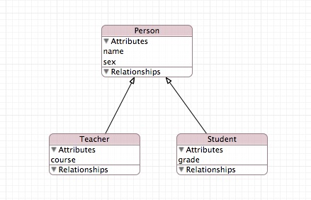
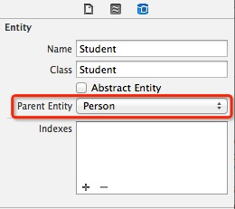

在为『掌拍』iOS 客户端设计数据库的时候，大幅度使用了 CoreData 中的『Entity Inheritance』这个特性，由此很好地解决了多个实体有共同 property 的问题，而特别借助实体类化（由实体生成对应的类）后的动态性，解决了数据动态传递的问题。这之后，对『Entity Inheritance』算是有了经验，但是还没有归纳总结，现在总结如下：

<!-- more -->

在 CoreData 中，『实体的继承』（entity inheritance）类似于『类的继承』（class inheritance），如果你有若干个相似的实体，就可以抽离出它们共同的 property (注意：property 包括了Attributes 和Relationships 两方面) 作为一个『父实体』，然后继承该『父实体』，而不是在让多个实体去重复描述共同的property，导致性能的下降。例如，有如下两个实体：

如图，Teacher实体和 Student 实体具有相同的attribute，我们可以抽离出来作为一个父实体，再让它们继承父实体，结果如下：

这样 Teacher 实体和 Student 实体都继承了 name 和 sex 这两个attribute。

那么该如何设置父实体呢？

1. 使用Xcode的可视化建模工具来创建：

	

2. 使用 code 来创建。但这需要自顶向下来执行，即一个实体不能直接设置父实体，而只能让父实体去设置子实体。具体操作是：把 Teacher 实体 和 Student 实体添加到子实体数组中，然后让目标父实体 Person 调用 [`setSubentities:`](https://developer.apple.com/library/ios/documentation/cocoa/Reference/CoreDataFramework/Classes/NSEntityDescription_Class/NSEntityDescription.html#jumpTo_25) 来进行设置。

---
### 参考资料：

1. https://developer.apple.com/library/ios/documentation/cocoa/Conceptual/CoreData/Articles/cdMOM.html
2. http://www.objc.io/issue-4/core-data-models-and-model-objects.html
3. http://blog.csdn.net/focusjava/article/details/9949499