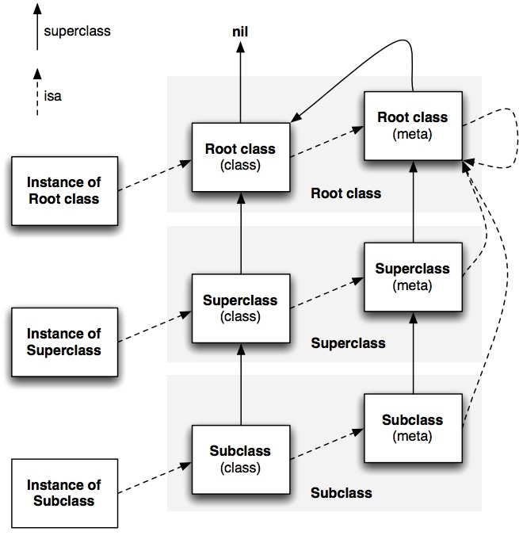

在比较之前，你应该了解以下知识：

1. [Objcetive-C的函数调用机制](http://blog.csdn.net/likendsl/article/details/7566031)
2. [Objective-C的对象模型](http://blog.devtang.com/blog/2013/10/15/objective-c-object-model/)
3. [Objective-C的动态特性](http://blog.leezhong.com/ios/2013/08/03/dynamic-tips-and-tricks-with-objective-c.html)

---
在阅读完毕，了解知道Objective-C 中的 *Message、Object、Class、MetaClass、Method（SEL-IMP)* 的重要概念后，现在开始比较！

下面是来自 WIKI 的对 static method 的[定义](http://en.wikipedia.org/wiki/Method_\(computer_programming\)#Static_methods)：

>Static methods neither require an instance of the class nor can they implicitly access the data (or this, self, Me, etc.) of such an instance. A static method is distinguished in some programming languages with the static keyword placed somewhere in the method's signature.

>In statically typed languages such as Java, static methods are called "static" because they are resolved statically (i.e. at compile time) based on the class they are called on and not dynamically as in the case with instance methods which are resolved polymorphically based on the runtime type of the object. Therefore, static methods cannot be overridden.


从定义可以看出，Objective-C 的 class method 根本不是 static method，而实际上，**Objective-C 也不存在 static method！**（尽管 class method 因为用法而看似 static method，但它们是有本质的差别的。）

那么它们的区别是？（出于好奇心，我们假设下 Objective-C 中有 static method → →）

<!-- more -->

从定义可知，**static method 是不可继承(inherit)和覆盖(override)的；**

但是，**class method 是可以继承(inherit)和覆盖(override)的。**

请看下面的例子：  
``` objc 

	@interface Animal : NSObject
	+ (id)newAnimal;
	@end
	
	@implementation Animal
	+ (id)newAnimal
	{
	    NSLog(@"now new an animal...");
	    return [[self alloc] init];
	}
	@end
	
	
	@interface Dock : Animal
	
	@end
	
	@implementation Dock
	
	@end
	
	
	@interface Chicken : Animal
	
	@end
	 
	@implementation Chicken
	+ (id)newAnimal
	{
	    id animal = [super newAnimal];
	    NSLog(@"now new a Chicken...");
	    return animal;
	}
	@end
	
	
	
	//Test
	Dock *dock = [Dock newAnimal];
	NSLog(@"---------------分割线----------------");
	Chicken *chicken = [Chicken newAnimal];
	... etc ...  

```

运行结果是：  

	now new an animal...
	---------------分割线----------------
	now new an animal...
	now new a Chicken...

由结果可以验证了class method 是可以继承(inherit)和覆盖(override)的。

那么为什么 class method 是可以继承和覆盖？因为：

在 Objective-C 中，class 其实也是一个对象，只不过它是一个特别的对象——由 MetaClass 生成的一个实例（an instance of metaclass），而 object 则是由 Class 生成的一个实例。（你可以像发送消息给 object 那样发送消息给 class 以调用对应的 class method，如上面的`[Chicken newAnimal]`，发送一条消息给 `Chicken` 类以调用 `newAnimal` 这个class method。）

而 MetaClass 则是 Objective-C 中最基本的类。Object、Class、MetaClass 三者的关系如下图所示：（该图片来自[这里](http://www.sealiesoftware.com/blog/archive/2009/04/14/objc_explain_Classes_and_metaclasses.html)）




所以，**class method 其实就是 MetaClass 的 instance method。**这就是它的本质，也是可以继承和覆盖的原因。


##参考资料：

1. http://programmers.stackexchange.com/questions/191856/what-is-a-static-method-compared-to-instance-class-private-public-methods
2. http://stackoverflow.com/questions/15965865/static-method-which-isnt-class-2.method-in-objective-c
3. http://stackoverflow.com/questions/8089186/whats-the-difference-between-class-method-and-static-method  
