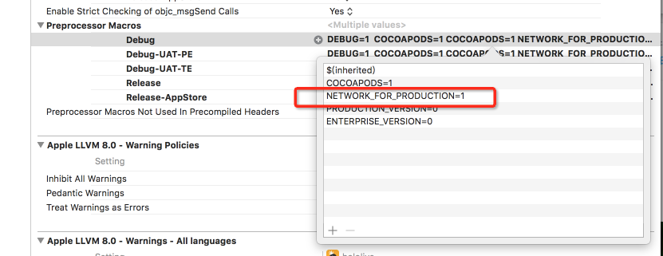
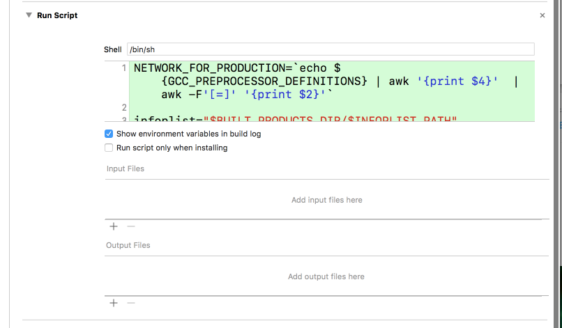

由于项目的正式网络环境的 host 是走域名，能支持 https ，测试网络环境的 host 是走 IP ，无法支持 https ，导致在做 ATS 支持的时候，遇到一个问题：在 debug 过程需要切换网络环境的时候，也需要手动去开启或者关闭 ATS 。为了节省这些时间，写了一个脚本去解决这个问题，让 ATS 根据网络环境的值自动去开启或者关闭。下面将会列出具体步骤。

1.在 [`Your Target`-Build Settings -Preprocessor Macros] 添加你的环境宏变量 `NETWORK_FOR_PRODUCTION` ，如下图：



2.在项目的 `Info.plist` 文件中添加 `NSAppTransportSecurity` ，类型为字典；然后在字典中添加一个 `NSAllowsArbitraryLoads` ，类型为布尔值。
```xml
<key>NSAppTransportSecurity</key>
<dict>
  <key>NSAllowsArbitraryLoads</key>
  <false/>
</dict>
```

>关于配置的坑
在 iOS 10下，多了 `NSAllowsArbitraryLoadsForMedia` 和 `NSAllowsArbitraryLoadsInWebContent` 两个选项。
当这2个选项与 `NSAllowsArbitraryLoads` 选项同时存在时，在 iOS 10 下，会优先看 `NSAllowsArbitraryLoadsForMedia` 和 `NSAllowsArbitraryLoadsInWebContent` 的配置，而忽略掉  `NSAllowsArbitraryLoads`。
基于以上规则，遇到的坑是：我设置了 `NSAllowsArbitraryLoadsInWebContent` 为 `true` （允许浏览器加载http网页），设置了 `NSAllowsArbitraryLoads` 为 `false` （关闭ATS），在 iOS 10 下，运行APP，ATS 实际上并没有被关闭，因为 iOS 10 优先看了 `NSAllowsArbitraryLoadsInWebContent` 的配置，认为 ATS 是开启的， 而 `NSAllowsArbitraryLoads` 的配置是直接被忽略了。
>

3.在 [`Your Target`-Build Phases-Run Script] 添加以下脚本代码即可：
```shell
NETWORK_FOR_PRODUCTION=`echo ${GCC_PREPROCESSOR_DEFINITIONS} | awk '{print $4}'  | awk -F'[=]' '{print $2}'`

infoplist="$BUILT_PRODUCTS_DIR/$INFOPLIST_PATH"

# 更改plist文件的ATS配置
if [[ ${NETWORK_FOR_PRODUCTION} == 1 ]]; then
    echo "打开ATS"
    /usr/libexec/PlistBuddy -c "Set :NSAppTransportSecurity:NSAllowsArbitraryLoads false" ${infoplist}
else
    echo "关闭ATS"
    /usr/libexec/PlistBuddy -c "Set :NSAppTransportSecurity:NSAllowsArbitraryLoads true" ${infoplist}
fi
```
其中`Run Script`的配置如下图：



> 关键脚本代码详解：
> ```shell
> NETWORK_FOR_PRODUCTION=`echo ${GCC_PREPROCESSOR_DEFINITIONS} | awk '{print $4}'  | awk -F'[=]' '{print $2}'`
> ```
> 此句代码是通过awk解析获取 `NETWORK_FOR_PRODUCTION` 的具体值：0或者1
> PS：如果你需要根据其他变量来设置 ATS ，则需要自己调整上述语句，获取你指定的变量的值。

4.如常运行调试代码即可~enjoy😄

