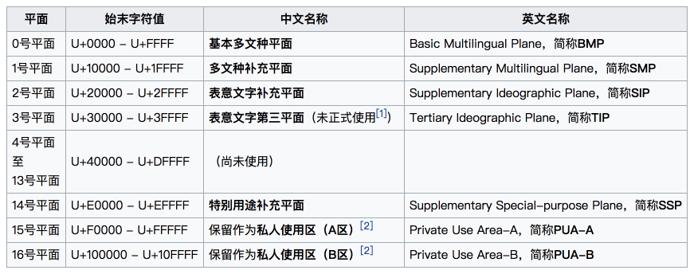

## 前言
Unicode 和 UTF-8 、UTF-16是什么关系呢？这是我最近好奇的一个问题。

<!-- more -->

## Unicode
Unicode 是计算机科学领域里的一项业界标准，包括字符集（包含来自世界各国各地的文字字符）和编码方案（将每个字符唯一映射到一个二进制编码）。

### Unicode 编码方式
Unicode 的基本元素是*码位（code point）*，共包含1114112个码位。码位通过使用数值表示，数值格式为：*U+hhhh*，其中每个*h*代表一个十六进制数字。

Unicode 的所有码位组成了一个编码空间。在Unicode编码空间，Unicode码位分为17组编排，每组称为**平面**（Plane），而每平面拥有65536个码位。如下图所示：

Unicode 遵守既定规则把世界上的字符一一映射到码位中。被使用的码位，其码点值就是对应字符的Unicode编码。如， [U+0041](http://unicode.org/cldr/utility/character.jsp?a=A) 表示拉丁字母 “A”；[U+40000](http://unicode.org/cldr/utility/character.jsp?a=40000&B1=Show) 由于没使用，不表示任何字符。

截止目前，才128237 个码位被使用——编码空间的 12% 被赋值，在后面还有很多空间可应对新出现的字符。

### Unicode 实现方式

Unicode 规定了字符的编码，但是没有规定如何实现字符的编码。实现编码的方式称为**Unicode 转换格式**（Unicode Transformation Format，简称为UTF）。

Unicode 编码范围从 U+0000 到 U+10FFFF。对于计算机而言，实现Unicode 编码的最简单方式是使用32-bit表示。但是每个字符使用4个字节表示会造成浪费。当你处理大量文本的时候，使用 32-bit 存储 Unicode 字符会占用大量额外存储、内存、带宽等，因为大多字符的第1和第2个字节都是0。

在日常，Unicode编码的实现方式主要有：UTF-8、UTF-16。

## UTF-8

UTF-8是一种可变长度字符编码方式，以8-bit 为单元，使用1至4个字节为每个字符编码。

UTF-8编码规则如下：

| Unicode编码范围 （十六进制）| UTF-8编码占用字节 |UTF-8 编码（二进制）|
| - | - |-|
| U+0000 - U+007F  | 1 | 0xxxxxxx  |
| U+0080 - U+07FF  | 2 |110xxxxx 10xxxxxx |
| U+0800 - U+FFFF  | 3 | 1110xxxx 10xxxxxx 10xxxxxx |
| U+10000 - U+10FFFF  | 4 | 11110xxx 10xxxxxx 10xxxxxx 10xxxxxx |

- 根据字符所在编码范围，确定其所占字节数

- 单字节的字符，字节的第一位设为0

- n个字节的字符(n>1)，第一个字节的前n位设为1，第n+1位设为0，后面字节的前两位都设为10，这n个字节的其余空位填充该字符unicode码，高位用0补足

下面，以汉字[“鱼”](http://unicode.org/cldr/utility/character.jsp?a=9C7C&B1=Show)为例，演示如何实现UTF-8编码。

“鱼”的Unicode编码是`9C7C`（`1001 1100 0111 1100`），根据上表，`9C7C` 的UTF-8编码需要占用3个字节，其格式为`1110xxxx 10xxxxxx 10xxxxxx`。然后，**从“鱼”的最后一个二进制位开始，依次从后向前填入格式中的`x`，多出的位补`0`**。这样，就得到“鱼”的UTF-8编码：`11101001 10110001 10111100`，转换为十六进制就是：`E9B1BC`

## UTF-16
UTF-16是一种可变长度字符编码方式，以16-bit 为单元，使用2个或4个字节为每个字符编码。

UTF-16的编码规则如下：

| Unicode编码范围 （十六进制）| UTF-16编码占用字节 |UTF-16 编码（二进制）|
| - | - |-|
| U+0000 - U+FFFF  | 2 | xxxxxxxx xxxxxxxx  |
| U+10000 - U+10FFFF  | 4 | 110110yyyyyyyyyy 110111xxxxxxxxxx |

- 把字符的Unicode编码记作 U
- 若U < 0x10000，字符的UTF-16编码就是U对应的16位二进制：xxxxxxxx xxxxxxxx 

- 若U ≥ 0x10000，则把字符拆分为2部分（U+10000 ~ U+10FFFF的空间大小是2^20），前十位映射到U+D800~U+DBFF，后十位映射到U+DC00~U+DFFF。具体拆分计算如下：

 - 计算U'=U-0x10000，
 - 将U'写成二进制形式：yyyy yyyy yyxx xxxx xxxx，
 - 按照`110110yyyyyyyyyy 110111xxxxxxxxxx`格式填入，即得到U的UTF-16编码（二进制）：110110yyyyyyyyyy 110111xxxxxxxxxx

>- 在基本平面（0x0000~0xFFFF）内，U+D800~U+DFFF是一个空段，即这些码位不对应任何字符
>- 辅助平面（0x10000~0x10FFFF）的字符位共有2^20个
>- U+D800~U+DBFF，空间大小是2^10；U+DC00~U+DFFF，空间大小是2^10。二者组合起来，正好可以表示辅助平面的字符。即：辅助平面的字符可以拆分为两个基本平面的字符表示——字符前10位映射在U+D800到U+DBFF，后10位映射在U+DC00到U+DFFF

下面，以汉字[“鱼”](http://unicode.org/cldr/utility/character.jsp?a=9C7C&B1=Show)和字符[“𝌀”](http://unicode.org/cldr/utility/character.jsp?a=1D300&B1=Show)为例，演示如何实现UTF-16编码。

“鱼”的Unicode编码是`9C7C`，根据上表，`9C7C < 0x10000` ，其UTF-16编码就是其Unicode编码：`1001 1100 0111 1100`，即0x9C7C。

“𝌀”的Unicode编码是`1D300`，根据上表，`1D300 > 0x10000 `，然后减去0x10000，得到0xD300，按`yyyy yyyy yyxx xxxx xxxx`格式写成二进制是：`0000 1101 0011 0000 0000`，然后按照`110110yyyyyyyyyy 110111xxxxxxxxxx`格式填入，得到“𝌀”的UTF-16编码（二进制）：`1101100000110100 1101111100000000`，即`0xD834 0xDF00`。

## 结论
回到先前的疑问：Unicode 和 UTF-8 、UTF-16是什么关系呢？

打个比喻，它们理论和实现的关系：Unicode制定了的理论，UTF-8和UTF-16是具体的实现方案。

而更形象的比喻则是：Unicode相当于中文, UTF-8、 UTF-16等相当于 行书、 楷书、草书等各种书写方式。

## 参考资料
https://zh.wikipedia.org/wiki/Unicode
https://zh.wikipedia.org/wiki/UTF-8
https://zh.wikipedia.org/wiki/UTF-16
http://www.ruanyifeng.com/blog/2014/12/unicode.html
http://blog.jobbole.com/111261/
http://blog.csdn.net/softman11/article/details/6124345
https://www.zhihu.com/question/23374078

