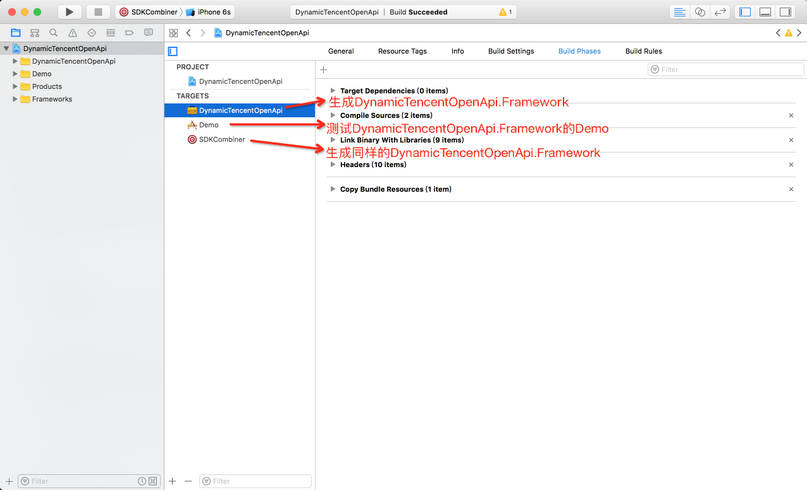
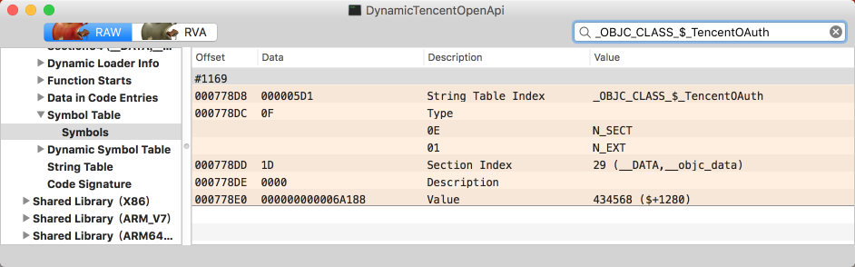
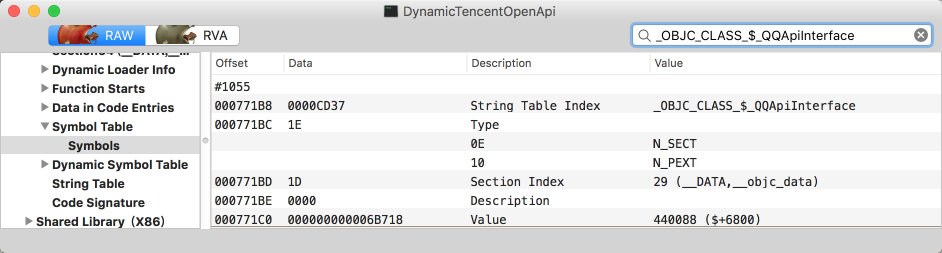
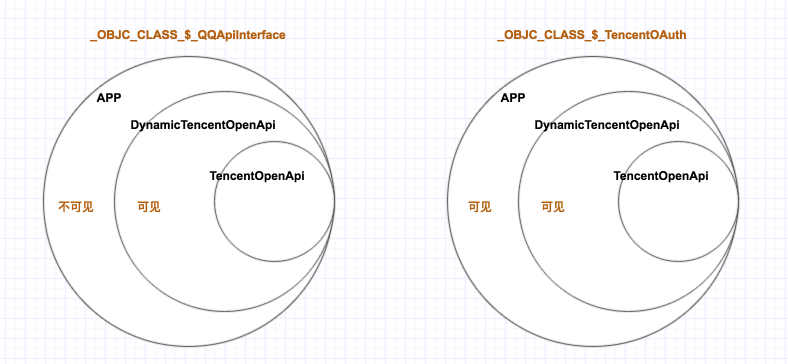

腾讯提供的iOS SDK ——[TencentOpenApi](http://wiki.open.qq.com/wiki/mobile/SDK%E4%B8%8B%E8%BD%BD) 是静态库，然后因为业务需求，需要把它转换为动态库（取名：DynamicTencentOpenApi）。在实际开发时，发现了一个奇怪的事情：

整个工程如下：
（有兴趣的读者，可直接下载[该工程](https://github.com/YK-Unit/DynamicTencentOpenApi)，进行实验）




Demo 的测试 DynamicTencentOpenApi.Framework  的主要代码如下：

``` objc
// 测试TencentOAuth
NSString *version = [TencentOAuth sdkVersion];
NSLog(@"%@",version);

// 测试QQApiInterface
NSString *qqInstallUrl = [QQApiInterface getQQInstallUrl];
NSLog(@"%@",qqInstallUrl);
```
运行编译工程的 DynamicTencentOpenApi Target 和 Demo Target，得到结果如下：

- DynamicTencentOpenApi.Framework 编译运行成功
- Demo 编译链接失败，报错误：`Undefined symbols for architecture x86_64: "_OBJC_CLASS_$_QQApiInterface"`

这里奇怪的地方在于：
- DynamicTencentOpenApi.Framework 编译运行成功
- Demo 编译链接时，TencentOAuth 的 symbol 能找到，QQApiInterface 的 symbol 却找不到？

用 [MachOView](https://github.com/gdbinit/MachOView) 查看 DynamicTencentOpenApi.Framework 里的 binary 文件发现：







- `_OBJC_CLASS_$_QQApiInterface` symbol 的类型是：`N_PEXT`
- `_OBJC_CLASS_$_TencentOAuth` symbol 的类型是：`N_EXT`

`N_PEXT` 和 `N_EXT` 的区别是：

>N_PEXT (0x10)—If this bit is on, this symbol is marked as having limited global scope. When the file is fed to the static linker, it clears the N_EXT bit for each symbol with the N_PEXT bit set. (The ld option -keep_private_externs turns off this behavior.) With macOS GCC, you can use the __private_extern__ function attribute to set this bit.
>
>N_EXT (0x01)—If this bit is on, this symbol is an external symbol, a symbol that is either defined outside this file or that is defined in this file but can be referenced by other files.
>
>https://developer.apple.com/documentation/kernel/nlist_64

翻译过来，这2者的区别是：
- `N_PEXT` ，意思是：private_extern。该类型的 symbol 在指定范围内可见
- `N_EXT` ，意思是：extern。该类型的 symbol，在任何范围内均可见

关于范围如图所示：



因此，在编译Demo-OC时，到链接阶段时，就找不到这个`_OBJC_CLASS_$_QQApiInterface` symbol，继而编译失败。

那么如何解决这个问题呢？

创建一个`QQApiInterface镜像类` ，镜像类 wrap `QQApiInterface`，对外提供和`QQApiInterface`一致的接口，在内则把对应的方法响应转发给`QQApiInterface`。具体可看例子中的镜像类 [QQApiInterfaceMirror](https://github.com/YK-Unit/DynamicTencentOpenApi/blob/master/DynamicTencentOpenApi/QQApiInterfaceMirror.m)。

原来准备按照这个方案实现 DynamicTencentOpenApi ，但是后面发现，TencentOpenApi SDK 里不止 QQApiInterface 的 symbol 是`N_PEXT`类型，还有`QQApiTextObject`、`QQApiExtendObject`、`QQApiImageObject`、`QQApiWebImageObject` 等类的 symbol 都是`N_PEXT`类型的。考虑到开发成本（为这些类创建同等的镜像类）和维护成本（TencentOpenApi SDK 升级后，每个镜像类都得重新测试），最终是放弃把 TencentOpenApi 从静态库转换到动态库 DynamicTencentOpenApi。

这种编译链接的错误（symbol的范围受限导致链接失败），相对来说，是比较少见的，因而花了很多时间去查，才找到了原因。希望这篇文章能让后面的来者可以避开此坑。enjoy~


## 参考资料：
- [convert_static_to_dynamic](https://pewpewthespells.com/blog/convert_static_to_dynamic.html)
- https://developer.apple.com/documentation/kernel/nlist_64
- [Controlling Symbol Visibility](https://developer.apple.com/library/content/documentation/DeveloperTools/Conceptual/CppRuntimeEnv/Articles/SymbolVisibility.html)
- [How to Use Static Library in Embedded Private Frameworks and App on iOS](https://stackoverflow.com/questions/32485110/how-to-use-static-library-in-embedded-private-frameworks-and-app-on-ios)

