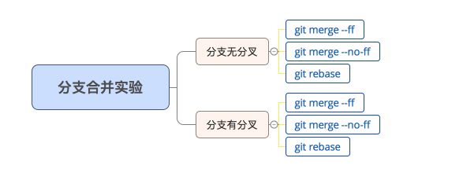
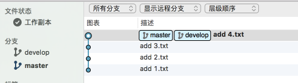
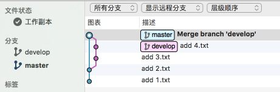
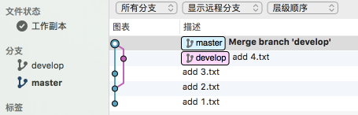

## 前言
在合并分支时（如合并develop分支到master分支），我们可以有以下命令的选择：

- ` git merge // 等同于 git merge --ff `
- `git merge --no-ff`
- `git rebase`

那么，这三者之间有哪些区别呢？对此，我将会通过下面的实验进行比较说明：



<!-- more -->

## 实验说明

在日常开发中，合并的两个分支（下面将会以日常用到的master分支和develop分支这2个分支进行举例），存在这2个情形：

- master分支和develop分支无分叉：只有develop分支有更新
- master分支和develop分支有分叉：两个分支均有更新

接下来的实验就是：分别在这两个情形下，分别通过 `git merge --ff` 、`git merge --no-ff ` 、`git rebase` 命令把develop分支合并到master分支，然后比较合并后的master的commit-tree。

`merge --ff` 、`merge --no-ff ` 、`rebase` 各自合并的步骤如下：

- 使用 `merge --ff`合并的步骤

  ```shell
  git checkout master
  git merge develop  // 等同 git merge --ff develop
  ```
  
- 使用 `merge --no-ff` 合并的步骤

  ```shell
  git checkout master
  git merge --no-ff develop
  ```
  
- 使用 `rebase` 合并的步骤

  ```shell
  git checkout develop
  git rebase master
  git checkout master
  git merge develop
  ```

## 实验结果

### 分支无分叉的场景下：

合并前：


分别执行merge/rebase后的情况对比：

- 应用`git merge --ff`
  
    

- 应用`git merge --no-ff`

    

- 应用`git rebase`

    


### 分支有分叉的场景下：

合并前：


分别执行merge/rebase后的情况对比：

- 应用`git merge --ff`

     

- 应用`git merge --no-ff`

    

- 应用`git rebase`

    

## 实验结论

通过结果图的对比，可以得到以下结论：

|         |  git merge --ff  |git merge --no-ff   |git rebase   |
| ------------- |:-----|:------|:-----|
|   分支无分叉      |   把develop上新的commit嫁接到master的最后commit上，效果等同于rebase，让master的commit-tree保持线性   | 生成一个新的commit用于记录这个合并操作   | 把develop上新的commit嫁接到master的最后一个commit上，让master的commit-tree保持线性   |
|   分支有分叉      | 合并时，由于存在冲突，生成一个新的commit用于记录此冲突，效果等同于 merge --no-ff    | 生成一个新的commit用于记录这个合并操作 | 通过rebase，把develop上新的commit嫁接到master的最后一个commit上，让master的commit-tree保持线性   |


## 怎么选择

通过合并结果对比可以知道，在合并时，我们就只需要『merge --no-ff 』和 『rebase』之间做选择即可。那么在日常开发中怎么选择呢？根据你的合并目的来：

|    合并目的     | 需要记录此次合并，如合并release分支   | 希望commit-tree整洁和成线性，如合并feature分支   |对commit-tree无要求，适合初学者   |
| ------------- |:-----:|:-----:|:-----:|
|    合并命令     |git merge --no-ff   |git rebase   | git merge |


## 参考资料
https://www.idaima.com/article/6773
http://www.jianshu.com/p/73ea5aca8bf3
http://www.jianshu.com/p/0613d8249863

