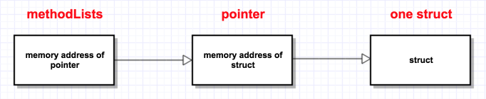
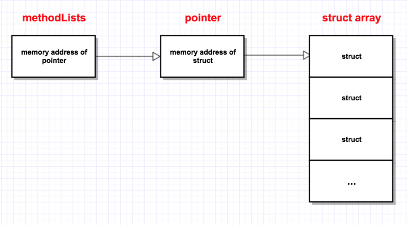
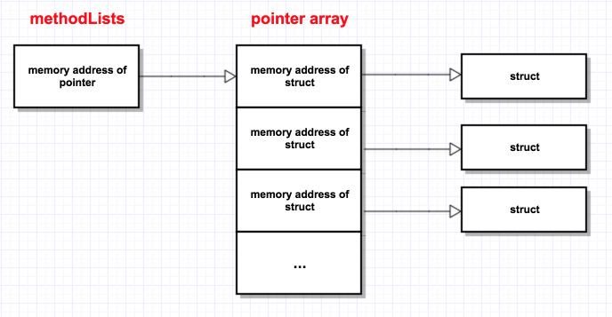
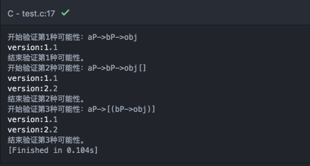

``` objc
//代码片段摘自苹果开源的runtime代码（objc4-208版本）
//https://opensource.apple.com/source/objc4/objc4-208/runtime/objc-class.h
struct objc_class {			
	struct objc_class *isa;	
	struct objc_class *super_class;	
	const char *name;		
	long version;
	long info;
	long instance_size;
	struct objc_ivar_list *ivars;

#if defined(Release3CompatibilityBuild)
	struct objc_method_list *methods;
#else
	struct objc_method_list **methodLists;
#endif

	struct objc_cache *cache;
 	struct objc_protocol_list *protocols;
};
```

这是Objective-C 2.0中的类的代码，相信做iOS开发的同学都很熟悉的了。有天在查资料又看到它的时候，想到了一个好奇的问题：

> `methodLists` 是一个二级指针，在内存中，它指向的是什么呢？（或者说，其指向的数据结构到底是怎么样的？）

<!-- more -->

然后，我想到了下面几个可能性：

- `methodLists` 指向的是一个结构体的指针

  

-  `methodLists` 指向的是结构体数组的指针

  

-  `methodLists` 指向的是结构体指针数组

  


那么上面的可能性都是存在的吗？为了验证，我写了下面的代码进行测试。

``` c
#include <stdio.h>

typedef struct {
  float version;
} method;


int main(int argc, char const *argv[]) {
  method **methodList;

  method aMethod;
  aMethod.version = 1.1;

  method bMethod;
  bMethod.version = 2.2;

  printf("开始验证第1种可能性：aP->bP->obj\n");
  method *aMethodP = &aMethod;
  methodList = &aMethodP;

  method* currentMethod = *methodList;
  float version = currentMethod->version;
  printf("version:%0.1f\n",version);

  printf("结束验证第1种可能性。\n");

  printf("开始验证第2种可能性：aP->bP->obj[]\n");
  method methodArray[2];
  methodArray[0] = aMethod;
  methodArray[1] = bMethod;

  *methodList = methodArray;
  for (size_t i = 0; i < 2; i++) {
    method* currentMethod = &((*methodList)[i]);
    float version = currentMethod->version;
    printf("version:%0.1f\n",version);
  }
  printf("结束验证第2种可能性。\n");

  printf("开始验证第3种可能性：aP->[(bP->obj)]\n");
  method* methodPointArray[2];
  methodPointArray[0]=&aMethod;
  methodPointArray[1]=&bMethod;

  methodList = &(methodPointArray[0]);
  for (size_t i = 0; i < 2; i++) {
    method* currentMethod = *(methodList+i);
    float version = currentMethod->version;
    printf("version:%0.1f\n",version);
  }
  printf("结束验证第3种可能性。\n");

  return 0;
}

```

运行结果如下：



按照上面提出的模型所编写的代码可以运行通过，这证明所说的3种可能性都存在，然而在`runtime `里使用的是哪种呢？

为此，特意去看了相关的代码，得到的答案是：第三种。

论据为：`runtime `中的`class `移除`method `的方法代码：

``` c
//代码片段摘自苹果开源的runtime代码（objc4-208版本）
//https://opensource.apple.com/source/objc4/objc4-208/runtime/objc-class.m

void class_removeMethods (Class cls, struct objc_method_list * meths)
{
	// Remove atomically.
	_objc_removeMethods (meths, &((struct objc_class *) cls)->methodLists);
	
	// Must flush when dynamically removing methods.  No need to flush
	// all the class method caches.  If cls is a meta class, though,
	// this will still flush it and any of its sub-meta classes.
	flush_caches (cls, NO); 
}
```

``` c
//代码片段摘自苹果开源的runtime代码（objc4-208版本）
//https://opensource.apple.com/source/objc4/objc4-208/runtime/objc-runtime.m

void _objc_removeMethods (struct objc_method_list * mlist, struct objc_method_list *** list)
{
	struct objc_method_list **	ptr;
 
        // Locate list in the array 
        ptr = *list;
        while (*ptr != mlist) {
                // fix for radar # 2538790
                if ( *ptr == END_OF_METHODS_LIST ) return;
                ptr += 1;
        }
 
        // Remove this entry 
        *ptr = 0;
  
        // Left shift the following entries
        while (*(++ptr) != END_OF_METHODS_LIST)
                *(ptr-1) = *ptr;
        *(ptr-1) = 0;
}

```

## 写在最后
那么对于标题提出的问题：『二级指针指向的数据结构是什么样的？』，它的标准答案是什么呢？

答案是：没有标准答案，它的答案应该是结合具体的业务代码来回答的，比如`Runtime`里的`methodLists`。

另外，在最后，不得不感叹下：指针真是C语言的灵魂，其让C变得何其灵活！（当然，同时也让C变得复杂，在你不知道作者的指针意图的时候）


