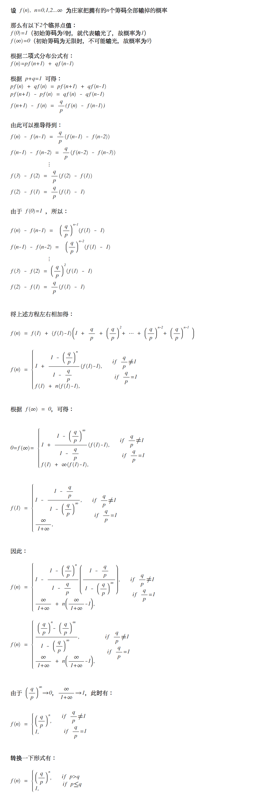
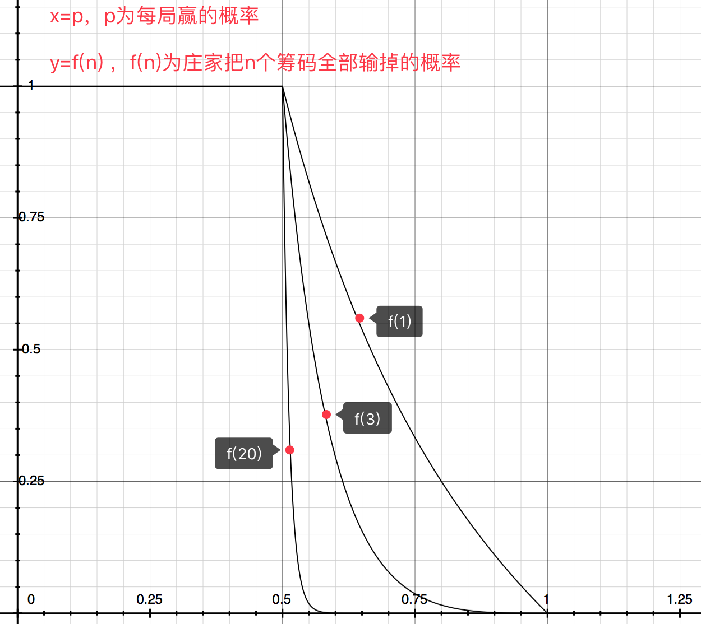
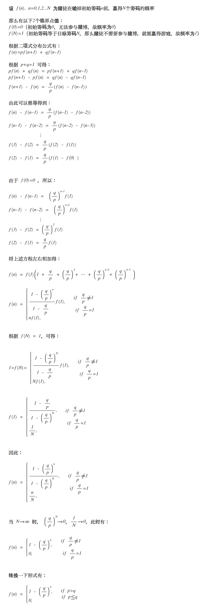
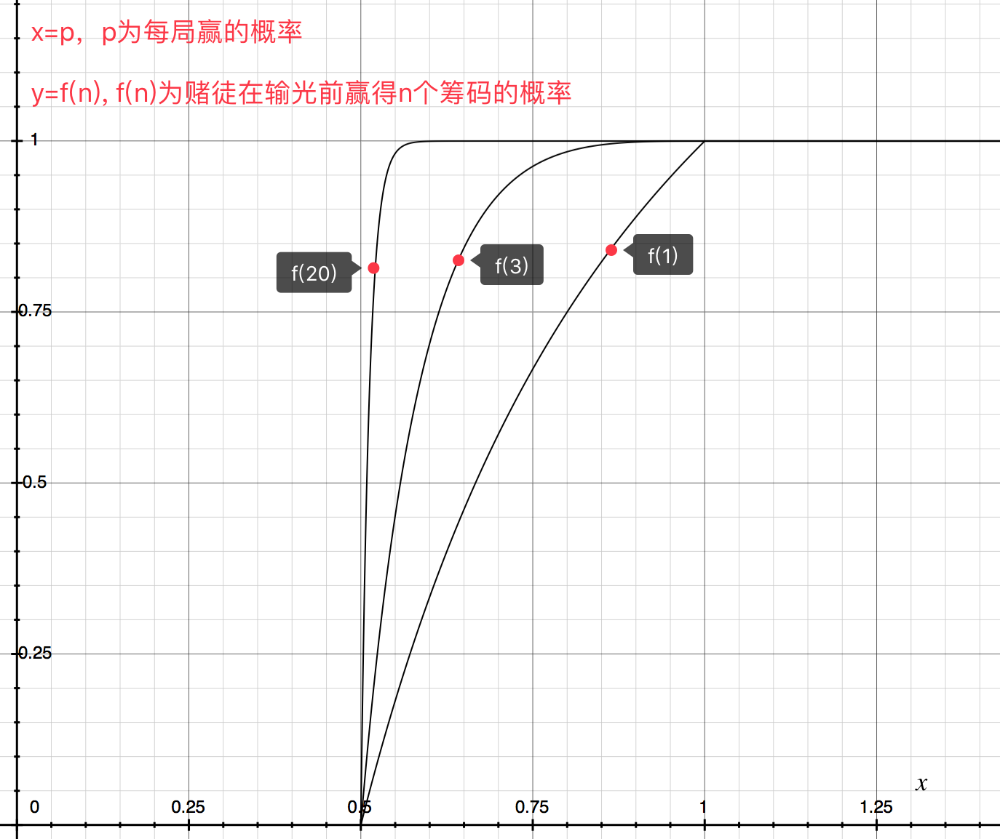

## 导语

以下是对“赌徒破产”系列问题的研究总结。通过数学证明，可见“十赌九输”并非虚言。

PS：由于MarkDown不支持数学公式，所以下面问题的证明过程是通过 [Daum Equation Editor](https://chrome.google.com/webstore/detail/daum-equation-editor/dinfmiceliiomokeofbocegmacmagjhe?hl=zh-CN) 来撰写，然后导出图片来展示。

## 庄家输掉所有筹码的概率
> 庄家有n个筹码，每次有概率p赢得一个筹码，或者概率q（q=1-p）输掉一个筹码。庄家输掉所有钱后，即终止游戏。假设各次赌博都是独立的，求庄家把所有筹码输光的概率。

**解答如下：**

**这是上述数学公式的二维图形：**

由公式和图可得：

- 当 p  < q 时，庄家必然输光筹码
- 当 p  >= q 时，p 相同时，庄家钱越多，输光筹码的概率越小

## 赌徒赢得N个筹码的概率
> 一个赌徒初始时有n个筹码，每次有概率p赢得一个筹码，或者概率q（q=1-p）输掉一个筹码。赌徒赢得N个筹码后，或者输掉所有钱后，即终止游戏。假设各次赌博都是独立的，求赌徒在输掉初始筹码前赢得N个筹码的概率。

**解答如下：**

**这是上述数学公式的二维图形：**

由公式和图可得：

- 当 p  <= q 时，赌徒是无法赢得了目标筹码数目的
- 当 p  > q 时，p 相同时，赢钱目标越大，赌徒赢取的概率越大

综合以上数学证明，再结合现实情况：

- 庄家的筹码往往多于一般赌徒
- 没有一个赌场会让赌徒赢的概率超过50%（即 p > q ）

赌徒进去赌场后，在有钱的庄家面前，玩着不超过50%胜率的游戏，赢钱就只是一个美丽的泡沫。

如果你不想输钱，那就远离赌博吧——这是保证百分之一百不会输钱的方法。

