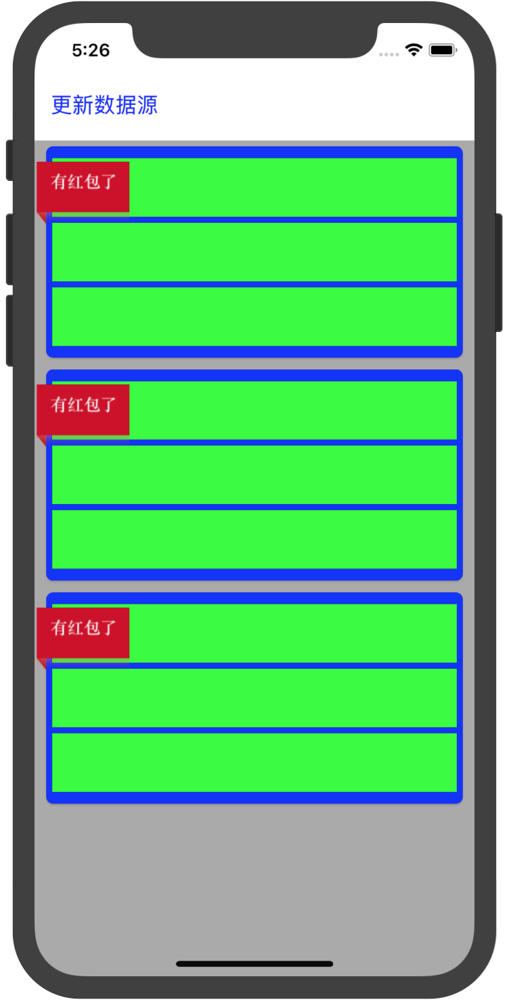
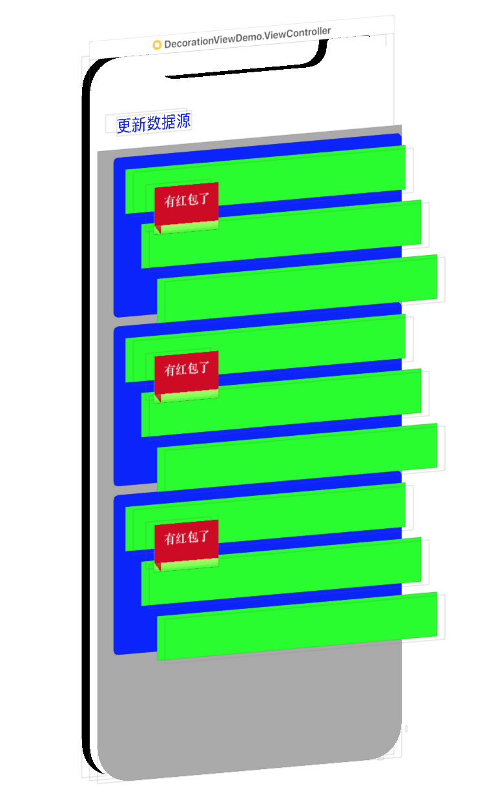
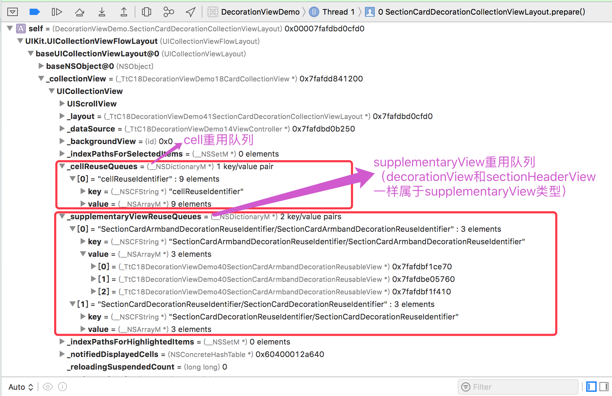

## 前言

在项目新版本中，要实现类似以下的效果：给每个`section`区域添加一个卡片装饰背景以及一个袖标装饰图标（卡片在所有的`cell`下，袖标在`cell`上面）。





这可以通过`UICollectionView` 的 `DecorationView` 特性来达到以上效果。本文主要是总结 `DecorationView` 的实现、重用机制和存在的坑。

## DecorationView 的实现（包括坑）

### 实现原理
1. 继承 `UICollectionViewLayoutAttributes`，实现用于描述装饰视图的布局属性的类，如描述卡片装饰视图的`SectionCardDecorationCollectionViewLayoutAttributes`
1. 继承 `UICollectionReusableView`，实现自己的装饰视图，如卡片装饰视图 `SectionCardDecorationReusableView`
1. 继承 `UICollectionViewFlowLayout`，实现自己的布局计算：主要是注册自定义的装饰视图和计算管理这些装饰视图的布局属性。如 `SectionCardDecorationCollectionViewLayout`
1. 继承 `UICollectionView`，override `layoutSubviews` 方法，解决装饰视图的一个坑（关于此坑，请看文章具体描述）

### 核心代码
**1. 自定义装饰图的布局属性**
``` Swift
/// section卡片装饰图的布局属性
class SectionCardDecorationCollectionViewLayoutAttributes: UICollectionViewLayoutAttributes {

    //背景色
    var backgroundColor = UIColor.white

    //所定义属性的类型需要遵从 NSCopying 协议
    override func copy(with zone: NSZone? = nil) -> Any {
        let copy = super.copy(with: zone) as! SectionCardDecorationCollectionViewLayoutAttributes
        copy.backgroundColor = self.backgroundColor
        return copy
    }

    //所定义属性的类型还要实现相等判断方法（isEqual）
    override func isEqual(_ object: Any?) -> Bool {
        guard let rhs = object as? SectionCardDecorationCollectionViewLayoutAttributes else {
            return false
        }

        if !self.backgroundColor.isEqual(rhs.backgroundColor) {
            return false
        }
        return super.isEqual(object)
    }
}
```
**2. 自定义装饰图**
``` Swift
/// Section卡片装饰视图
class SectionCardDecorationReusableView: UICollectionReusableView {

    override init(frame: CGRect) {
        super.init(frame: frame)
        self.customInit()
    }

    required init(coder aDecoder: NSCoder) {
        super.init(coder: aDecoder)!
        self.customInit()
    }

    func customInit() {
        self.backgroundColor = UIColor.white

        self.layer.cornerRadius = 6.0
        self.layer.borderColor = UIColor.clear.cgColor
        self.layer.borderWidth = 1.0
        // SketchShadow: color-(0,0,0,0.17),x-0,y-1,blur-2,spread-0
        self.layer.shadowColor = UIColor.black.cgColor
        self.layer.shadowOpacity = 0.17
        self.layer.shadowOffset = CGSize.init(width: 0, height: 1.0)
        self.layer.shadowRadius = 1
    }

    //通过apply方法让自定义属性生效
    override func apply(_ layoutAttributes: UICollectionViewLayoutAttributes) {
        super.apply(layoutAttributes)

        guard let attr = layoutAttributes as? SectionCardDecorationCollectionViewLayoutAttributes else {
            return
        }

        self.backgroundColor = attr.backgroundColor
    }
}

let SectionCardDecorationViewKind = "SectionCardDecorationReuseIdentifier"
```

**3. 自定义 `UICollectionViewFlowLayout `**

   >自定义 `UICollectionViewFlowLayout`，主要是实现自己的布局计算。主要的计算操作有：
  >
  > - 初始化时进行装饰视图的注册操作（对应 `setup` 方法）
  > - override `prepare` 方法，计算生成装饰视图的布局属性
  > - override `layoutAttributesForElements` 方法，返回可视范围下装饰视图的布局属性

``` Swift
/// 卡片式背景CollectionViewLayout
class SectionCardDecorationCollectionViewLayout: UICollectionViewFlowLayout {

    //保存所有自定义的section背景的布局属性
    private var cardDecorationViewAttrs: [Int:UICollectionViewLayoutAttributes] = [:]
    private var armbandDecorationViewAttrs: [Int:UICollectionViewLayoutAttributes] = [:]

    public weak var decorationDelegate: SectionCardDecorationCollectionViewLayoutDelegate?

    override init() {
        super.init()
        setup()
    }

    required init?(coder aDecoder: NSCoder) {
        super.init(coder: aDecoder)
    }

    override func awakeFromNib() {
        super.awakeFromNib()

        setup()
    }

    //初始化时进行一些注册操作
    func setup() {
        //注册DecorationView
        self.register(SectionCardDecorationReusableView.self,
                      forDecorationViewOfKind: SectionCardDecorationViewKind)

        self.register(SectionCardArmbandDecorationReusableView.self,
                      forDecorationViewOfKind: SectionCardArmbandDecorationViewKind)
    }

    override func prepare() {
        super.prepare()

        // 如果collectionView当前没有分区，则直接退出
        guard let numberOfSections = self.collectionView?.numberOfSections
            else {
                return
        }

        let flowLayoutDelegate: UICollectionViewDelegateFlowLayout? = self.collectionView?.delegate as? UICollectionViewDelegateFlowLayout

        // 不存在cardDecorationDelegate就退出
        guard let strongCardDecorationDelegate = decorationDelegate else {
            return
        }

        // 删除旧的装饰视图的布局数据
        self.cardDecorationViewAttrs.removeAll()
        self.armbandDecorationViewAttrs.removeAll()

        //分别计算每个section的装饰视图的布局属性
        for section in 0..<numberOfSections {
            //获取该section下第一个，以及最后一个item的布局属性
            guard let numberOfItems = self.collectionView?.numberOfItems(inSection: section),
                numberOfItems > 0,
                let firstItem = self.layoutAttributesForItem(at:
                    IndexPath(item: 0, section: section)),
                let lastItem = self.layoutAttributesForItem(at:
                    IndexPath(item: numberOfItems - 1, section: section))
                else {
                    continue
            }

            //获取该section的内边距
            var sectionInset = self.sectionInset
            if let inset = flowLayoutDelegate?.collectionView?(self.collectionView!,
                                                              layout: self, insetForSectionAt: section) {
                sectionInset = inset
            }

            //计算得到该section实际的位置
            var sectionFrame = firstItem.frame.union(lastItem.frame)
            //计算得到该section实际的尺寸
            if self.scrollDirection == .horizontal {
                sectionFrame.origin.x -= sectionInset.left
                sectionFrame.origin.y = sectionInset.top
                sectionFrame.size.width += sectionInset.left + sectionInset.right
                sectionFrame.size.height = self.collectionView!.frame.height
            } else {
                sectionFrame.origin.x = sectionInset.left
                sectionFrame.origin.y -= sectionInset.top
                sectionFrame.size.width = self.collectionView!.frame.width
                sectionFrame.size.height += sectionInset.top + sectionInset.bottom
            }


            // 想判断卡片是否可见
            let cardDisplayed = strongCardDecorationDelegate.collectionView(self.collectionView!, layout: self, decorationDisplayedForSectionAt: section)
            guard cardDisplayed == true else {
                continue
            }

            // 计算卡片装饰图的属性
            let cardDecorationInset = strongCardDecorationDelegate.collectionView(self.collectionView!, layout: self, decorationInsetForSectionAt: section)
            //计算得到cardDecoration该实际的尺寸
            var cardDecorationFrame = sectionFrame
            if self.scrollDirection == .horizontal {
                cardDecorationFrame.origin.x = sectionFrame.origin.x + cardDecorationInset.left
                cardDecorationFrame.origin.y = cardDecorationInset.top
            } else {
                cardDecorationFrame.origin.x = cardDecorationInset.left
                cardDecorationFrame.origin.y = sectionFrame.origin.y + cardDecorationInset.top
            }
            cardDecorationFrame.size.width = sectionFrame.size.width - (cardDecorationInset.left + cardDecorationInset.right)
            cardDecorationFrame.size.height = sectionFrame.size.height - (cardDecorationInset.top + cardDecorationInset.bottom)

            //根据上面的结果计算卡片装饰图的布局属性
            let cardAttr = SectionCardDecorationCollectionViewLayoutAttributes(
                forDecorationViewOfKind: SectionCardDecorationViewKind,
                with: IndexPath(item: 0, section: section))
            cardAttr.frame = cardDecorationFrame

            // zIndex用于设置front-to-back层级；值越大，优先布局在上层；cell的zIndex为0
            cardAttr.zIndex = -1
            //通过代理方法获取该section卡片装饰图使用的颜色
            let backgroundColor = strongCardDecorationDelegate.collectionView(self.collectionView!, layout: self, decorationColorForSectionAt: section)
            cardAttr.backgroundColor = backgroundColor

            //将该section的卡片装饰图的布局属性保存起来
            self.cardDecorationViewAttrs[section] = cardAttr


            // 先判断袖标是否可见
            let armbandDisplayed = strongCardDecorationDelegate.collectionView(self.collectionView!, layout: self, armbandDecorationDisplayedForSectionAt: section)
            guard armbandDisplayed == true else {
                continue
            }

            // 如果袖标图片名称为nil，就跳过
            guard let imageName = strongCardDecorationDelegate.collectionView(self.collectionView!, layout: self, armbandDecorationImageForSectionAt: section) else {
                continue
            }

            // 计算袖标装饰图的属性
            var armbandDecorationInset = cardDecorationInset
            armbandDecorationInset.left = 1
            armbandDecorationInset.top = 18
            if let topOffset = strongCardDecorationDelegate.collectionView(self.collectionView!, layout: self, armbandDecorationTopOffsetForSectionAt: section) {
                armbandDecorationInset.top = topOffset
            }
            //计算得到armbandDecoration该实际的尺寸
            var armbandDecorationFrame = sectionFrame
            if self.scrollDirection == .horizontal {
                armbandDecorationFrame.origin.x = sectionFrame.origin.x + armbandDecorationInset.left
                armbandDecorationFrame.origin.y = armbandDecorationInset.top
            } else {
                armbandDecorationFrame.origin.x = armbandDecorationInset.left
                armbandDecorationFrame.origin.y = sectionFrame.origin.y + armbandDecorationInset.top
            }
            armbandDecorationFrame.size.width = 80
            armbandDecorationFrame.size.height = 53

            // 根据上面的结果计算袖标装饰视图的布局属性
            let armbandAttr = SectionCardArmbandDecorationCollectionViewLayoutAttributes(
                forDecorationViewOfKind: SectionCardArmbandDecorationViewKind,
                with: IndexPath(item: 0, section: section))
            armbandAttr.frame = armbandDecorationFrame
            armbandAttr.zIndex = 1
            armbandAttr.imageName = imageName
            //将该section的袖标装饰视图的布局属性保存起来
            self.armbandDecorationViewAttrs[section] = armbandAttr
        }
    }

    //返回rect范围下父类的所有元素的布局属性以及子类自定义装饰视图的布局属性
    override func layoutAttributesForElements(in rect: CGRect)
        -> [UICollectionViewLayoutAttributes]? {
            var attrs = super.layoutAttributesForElements(in: rect)
            attrs?.append(contentsOf: self.cardDecorationViewAttrs.values.filter {
                return rect.intersects($0.frame)
            })
            attrs?.append(contentsOf: self.armbandDecorationViewAttrs.values.filter {
                return rect.intersects($0.frame)
            })
            return attrs
    }

    //返回对应于indexPath的位置的装饰视图的布局属性
    override func layoutAttributesForDecorationView(ofKind elementKind: String,
                                                    at indexPath: IndexPath) -> UICollectionViewLayoutAttributes? {
        let section = indexPath.section
        if elementKind == SectionCardDecorationViewKind {
            return self.cardDecorationViewAttrs[section]
        } else if elementKind == SectionCardArmbandDecorationViewKind {
            return self.armbandDecorationViewAttrs[section]
        }
        return super.layoutAttributesForDecorationView(ofKind: elementKind,
                                                       at: indexPath)
    }
}
```

**4. 自定义 `UICollectionView`，解决装饰视图的坑**

> 在描述这个坑前，需要先普及一个知识点：如何控制`UICollectionView`的子视图的层级关系，如让卡片装饰视图居于cell下面？
>
> 答案是：使用`UICollectionViewLayoutAttributes` 的 `zIndex` 属性。  `UICollectionView`进行布局时，会依据子视图的布局属性的 `zIndex` 的值的大小来控制子视图的 **front-to-back** 层级关系（在前或者在后）。cell 的布局属性的 `zIndex` 的值为0，所以若要卡片装饰视图在 cell 下面，只要设置其布局属性的 `zIndex` 的值小于0即可。
>
>在知道这个知识点后，让我来具体描述一下的 `UICollectionView` 的在装饰视图的坑：在iOS10+上，`zIndex` 会随机失效。具体表现为，卡片装饰视图的布局属性的 `zIndex` 设置为 -1，比 cell 的小，理论上进行布局时，卡片装饰视图应该总是在 cell 下面；但是实际上，当你的 `UICollectionView` 比较复杂时，会 **随机** 出现某些 cell 布局在了卡片装饰视图下面，如图所示（由于这个“随机问题”只出现在具体的项目中，不出现在Demo中，为了方便说明问题，特意“手动”实现这种“随机问题”的效果来生成截图😂）：
>
>
>
>对于这个“随机”问题，国外论坛也有对应的[讨论](https://github.com/lionheart/openradar-mirror/issues/15453)。
>
>在该讨论的帖子下，有开发者建议通过设置 `cell.layer.zPosition` 来解决，但是我在尝试后，发现这个方法无效。最后，我使用了另一个方法来解决：自定义 `UICollectionView`，override `layoutSubviews` 方法，手动调整装饰视图和cell的层级关系。

``` Swift
class CardCollectionView: UICollectionView {

    override func layoutSubviews() {
        super.layoutSubviews()

        var sectionCardViews: [UIView] = []

        self.subviews.forEach { (subview) in
            if let decorationView = subview as? SectionCardDecorationReusableView {
                sectionCardViews.append(decorationView)
            }
        }

        sectionCardViews.forEach { (decorationView) in
            self.sendSubview(toBack: decorationView)
        }
    }
}

```

## DecorationView 的重用机制

在 `UICollectionView` 里，DecorationView 的重用机制和 Cell 的重用机制是一致的：使用前，先注册（只不过 DecorationView 的注册是由`UICollectionViewFlowLayout`来发起——实际还是 UICollectionView 进行最终的注册操作）；使用时，由`UICollectionView`根据上下文创建新的 DecorationView 或者返回旧的 DecorationView。

那么以上结论的依据是什么呢？请看下面的`UICollectionView`的重用队列属性即可知道：



在 `UICollectionView` 里面有2种视图类型的重用队列，分别是 Cell 类型（对应`cellReuseQueues`） 和 Supplementary 类型（对应`supplementaryReuseQueues`）。这2种类型的重用机制是一样的。其中，DecorationView 是 SupplementaryView 的一种。


## 结语
最后，附上Demo代码。具体，请点击这个 [repo](https://github.com/YK-Unit/DecorationViewDemo)。

