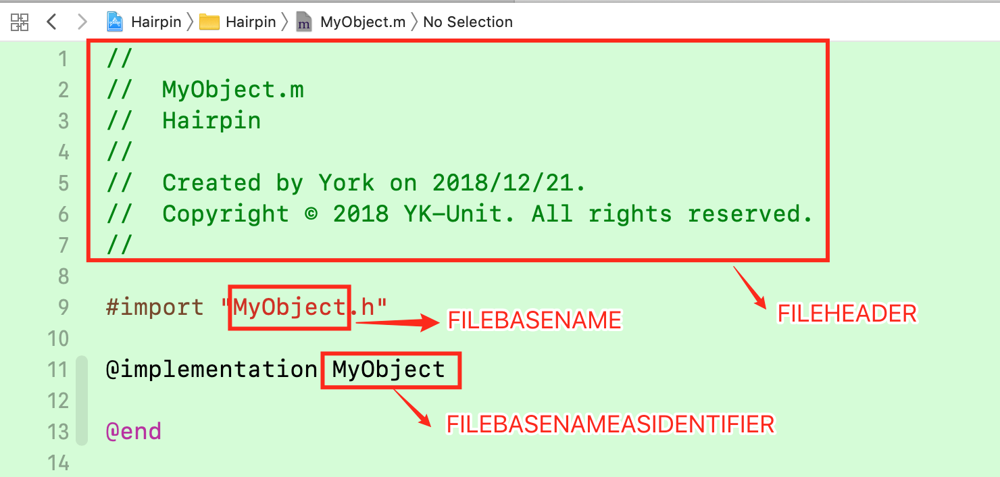
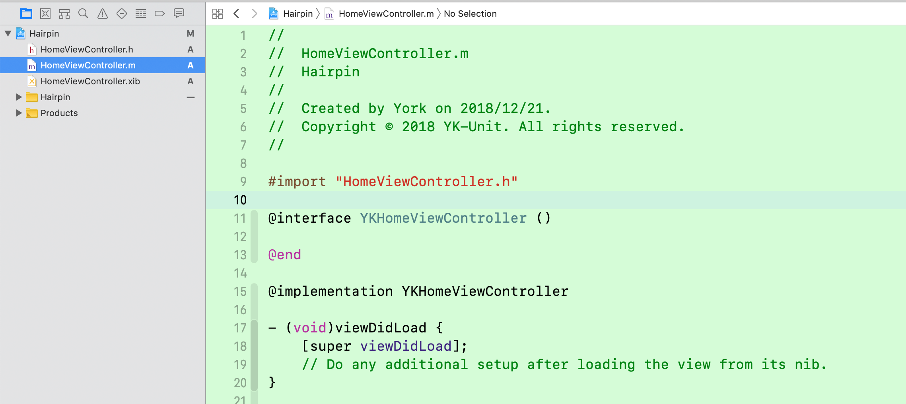

## 前言

文本宏（`Text Macros`）是Xcode隐藏的特性，直到Xcode 9.0后，苹果官方才开始允许开发者进行自定义文本宏。下面将会详细介绍文本宏的相关知识和应用场景。

<!-- more -->

## 什么是文本宏

文本宏（`Text Macro`）是一种可以就地展开（`expanded in-place`）为特定文本的符号。其常见于Xcode文件模板中，如图所示：


图中的`FILEHEADER`、`FILEBASENAME`、`FILEBASENAMEASIDENTIFIER`就是所说的文本宏。Xcode在使用文件模板创建文件时，会把文件模板中的文本宏，展开生成特定的文本，如使用`NSObjectObjective-C`文件模板创建一个文件名为`MyObject.m`的文件时，`FILEHEADER`会展开生成头部注释信息，`FILEBASENAME`会展开生成字符串`MyObject`，`FILEBASENAMEASIDENTIFIER`会展开生成字符串`MyObject`，如下图所示：




> **延伸阅读**
> 
> Xcode模板有文件模板和工程模板。模板文件按照开发平台存放，其中每个平台的模板位置如下：
>
> - macOS平台模板：`/Applications/Xcode.app/Contents/Developer/Library/Xcode/Templates`
> - iOS平台模板：`/Applications/Xcode.app/Contents/Developer/Platforms/iPhoneOS.platform/Developer/Library/Xcode/Templates`
> - tvOS平台模板：`/Applications/Xcode.app/Contents/D
eveloper/Platforms/AppleTVOS.platform/Developer/Library/Xcode/Templates`
> - watchOS平台模板：`/Applications/Xcode.app/Contents/Developer/Platforms/WatchOS.platform/Developer/Library/Xcode/Templates`


## 公开可用的文本宏

当前Xcode在其官方文档公开给开发者可用的文本宏有以下几类：

**时间类：**

- DATE

    > 当前的日期，如`2018/12/20`。

- YEAR

    > 四位数字格式的当前年数，如`2018`
    
- TIME

    > 当前的时间，如`20:48`
    

**开发环境类：**

- RUNNINGMACOSVERSION

    > 当前`macOS`系统的版本。

- DEFAULTTOOLCHAINSWIFTVERSION

    > 当前工程使用的`Swift`版本。
    
- FULLUSERNAME

    > 当前系统用户的全名。

- USERNAME

    > 当前`macOS`用户的登录名。
    
    

**开发工程配置类：**

- ORGANIZATIONNAME

    > 当前工程配置的公司名称。

- WORKSPACENAME

    > 当前`Workspace`的名称。如果`Workspace`中只有一个 `Project`，那么这个宏的值便是当前打开的`Project`的名称。

- PROJECTNAME

    > 当前工程的名称。

- TARGETNAME

    > 当前`Target`的名称。

- PACKAGENAME

    > 当前工程`Scheme`所设置的包名。

- PACKAGENAMEASIDENTIFIER

    > 把不符合`C语言标识符规范`的字符替换为下划线（`_`）后的`PACKAGENAME`。

- PRODUCTNAME

    > 当前工程`Scheme`设置的应用名称。

- COPYRIGHT
  
    > 当前工程的版权信息，如`Copyright © 2018 YK-Unit. All rights reserved.`。
    > 
    > 需要注意的是，若当前Xcode工程没有配置公司名，该值会是一个空字符串。

**文本文件信息类：**

- FILENAME
  
    > 当前文件的完整名称，包括扩展名。

- FILEBASENAME

    > 删除掉扩展名后的`FILENAME`，如创建一个名为`MyObject.m`的文件，该值为`MyObject`。

- FILEBASENAMEASIDENTIFIER

    > 把不符合`C语言标识符规范`的字符替换为下划线（`_`）后的`FILEBASENAME`，如创建一个名为`My-Object.m`的文件，该值为`My_Object`。
    > 
    > 注：`C语言标识符规范`只允许使用字母（`A-Z`, `a-z`）和数字（`0-9`）以及下划线（`_`），使用这个宏会把其他的字符自动替换成下划线。

- FILEHEADER

    > 每个文本文件头部的文本。
    > 
    > 注：该文本宏其实是由多个文本宏组成，其首先是展开生成以下文本：
    > ```
    > //  ___FILENAME___
    > //  ___PACKAGENAME___
    > //
    > //  Created by ___FULLUSERNAME___ on ___DATE___.
    > //  ___COPYRIGHT___
    > //
    > ```
    > 之后Xcode再把上述的宏文本展开生成对应的文本，最后生成的就是我们日常看到的文件头部注释信息了。

**其他：**
- NSHUMANREADABLECOPYRIGHTPLIST

    > `macOS app`工程的`target`中的`Info.plist` 文件中`人类可读的版权信息`条目的值，该值包括这个条目的`key`和`value`以及`XML`的分隔符，如：
    >
    > ```
    > <key>NSHumanReadableCopyright</key>
    > <string>Copyright © 2017 Apple, Inc. All rights reserved.</string>
    > ```
    > 
    > 
    > 
    
- UUID

    > 使用这个宏的时候，会返回一个唯一`ID`。具体应用场景待探索。


## 如何使用文本宏

使用文本宏的方式很简单，只需要在文本宏之前和之后添加三条下划线（`_`）即可，如使用`FILENAME`文本宏：

```
___FILENAME___
```

## 如何格式化文本宏的值

文本宏展开生成的值，不一定符合开发要求，如创建文件时，开发者输入的文件名带有非法的字符。为此，Xcode通过提供修饰符（`modifier`）来对文本宏的值进行格式化。使用修饰符的方法如下：

```
<MACRO>:<modifier>[,<modifier>]…
```

文本宏和修饰符之间用分号（`:`）分隔。多个修饰符之间可以用逗号（`,`）分隔。

把文本宏和特定的修饰符结合起来后，就可以修改文本宏的最终值，如下面这段宏可以删除掉的`FILENAME`的扩展名以及使用下划线（`_`）替换掉不符合`C标识符`的字符：

```
FILENAME:deletingPathExtension,identifier
```

> 这时候的`FILENAME:deletingPathExtension,identifier`等同于`FILEBASENAMEASIDENTIFIER`


当前Xcode提供的修饰符有：

- identifier
  
    > 用下划线（`_`）替换所有不符合`C语言标识符规范`的字符。
    >
    > 注：`C语言标识符规范`只允许使用字母（`A-Z`, `a-z`）和数字（`0-9`）以及下划线（`_`）

- bundleIdentifier

    > 用连字符（`-`）替换所有不符合`bundle标识符规范`的字符。
    >
    > 注：`bundle标识符规范`只允许使用字母（`A-Z`, `a-z`）和数字（`0-9`）以及连字符（`-`）。
    
- rfc1034Identifier

    > 用连字符（`-`）替换所有不符合[`rfc1034标识符规范`](https://www.ietf.org/rfc/rfc1034.txt)的字符

- xml

    > 将一些特殊的`XML`字符用其转义字符替换。如，`<`会被 `&lt` 替换。

- deletingLastPathComponent

    > 从展开的字符串中删除最后一个路径组件 (`path component`)。

- deletingPathExtension

    > 从展开的字符串中删除扩展名。

- deletingTrailingDot

    > 删除所有句子末尾的句点（`.`）

- lastPathComponent

    > 仅返回字符最后一个路径组件。
    
- pathExtension

    > 返回字符的扩展名。


​    
## 文本宏的应用

从Xcode 9.0开始，开发者可以自定义文本宏（覆盖已有的文本宏或者添加新的文本宏）。但是，实际开发中，文本宏的应用场景很少，目前暂时只发现了2个应用场景（若有其他场景，欢迎补充）：

- 自定义文件头部注释
- 给创建的类都添加统一前缀

下面将会演示如何如何实现上述场景。

但是，**在这之前，开发者需要创建一个名为`IDETemplateMacros.plist`的文件，并把文件放置在下面文件目录列表中的一个**：

> 注意：
> - 不同位置具有不同的影响范围。
> - `IDETemplateMacros.plist`文件可以放置到以下几个位置中的任何一个。但是建议只放置在一个地方。
> - 当存在多个`IDETemplateMacros.plist`文件时，Xcode只会使用最先找到的`IDETemplateMacros.plist`。

- `Project user data`位置:

    `<ProjectName>.xcodeproj/xcuserdata/[username].xcuserdatad/IDETemplateMacros.plist`

    影响范围：对当前 Project 指定的用户（username）创建的文件有影响
- `Project shared data`位置:

    `<ProjectName>.xcodeproj/xcshareddata/IDETemplateMacros.plist`

    影响范围：对当前 Project 的所有成员创建的文件有影响
- `Workspace user data`位置:

    `<WorkspaceName>.xcworkspace/xcuserdata/[username].xcuserdatad/IDETemplateMacros.plist`

    影响范围：对当前的 Workspace 下的指定的用户（username）创建的文件有影响
- `Workspace shared data`位置:

    `<WorkspaceName>.xcworkspace/xcshareddata/IDETemplateMacros.plist`

    影响范围：对当前 Workspace 下的所有成员创建的文件有影响
- `User Xcode data`位置:

    `~/Library/Developer/Xcode/UserData/IDETemplateMacros.plist`
    
    影响范围：对当前 Xcode 创建的文件都有影响
    

### 自定义文件头部注释

Xcode文件模板中，使用`FILEHEADER`文本宏来展开生成头部注释，所以只需要在`IDETemplateMacros.plist`中重定义`FILEHEADER`即可。编辑后的`IDETemplateMacros.plist`如下:

``` xml
<?xml version="1.0" encoding="UTF-8"?>
<!DOCTYPE plist PUBLIC "-//Apple//DTD PLIST 1.0//EN" "http://www.apple.com/DTDs/PropertyList-1.0.dtd">
<plist version="1.0">
<dict>
	<key>FILEHEADER</key>
	<string>
//                         __   _,--="=--,_   __
//                        /  \."    .-.    "./  \
//                       /  ,/  _   : :   _  \/` \
//                       \  `| /o\  :_:  /o\ |\__/
//                        `-'| :="~` _ `~"=: |
//                           \`     (_)     `/
//                    .-"-.   \      |      /   .-"-.
//.------------------{     }--|  /,.-'-.,\  |--{     }-----------------.
// )                 (_)_)_)  \_/`~-===-~`\_/  (_(_(_)                (
//                                                                     
//		File Name:		___FILENAME___
//		Product Name:	___PRODUCTNAME___
//		Author:			___AUTHOR___
//		Swift Version:	___DEFAULTTOOLCHAINSWIFTVERSION___
//		Created Date:	___DATETIME___
//		
//		Copyright © ___YEAR___ ___ORGANIZATIONNAME___.
//		All rights reserved.
// )                                                                  (
//'--------------------------------------------------------------------'
	</string>
	<key>AUTHOR</key>
	<string>___USERNAME___@___ORGANIZATIONNAME___</string>
	<key>DATETIME</key>
	<string>___DATE___ ___TIME___</string>
</dict>
</plist>
```
> 注意：示例中不止是重定义`FILEHEADER`，还新增了新的文本宏`AUTHOR`和`DATETIME`。

这时候使用Xcode创建的文本文件的头部注释如下：


> 注释中的`dog`图形是使用命令行字符形状工具[`boxes`](https://boxes.thomasjensen.com/)生成。
>
> `boxes`支持创建各种字符形状，有兴趣的童鞋不妨去探索下。

### 给创建的类都添加统一前缀

Xcode文件模板中，使用`FILEBASENAMEASIDENTIFIER`文本宏来展开生成类名，所以只需要在`IDETemplateMacros.plist`中重定义`FILEBASENAMEASIDENTIFIER`即可。编辑后的`IDETemplateMacros.plist`如下:

``` xml
<?xml version="1.0" encoding="UTF-8"?>
<!DOCTYPE plist PUBLIC "-//Apple//DTD PLIST 1.0//EN" "http://www.apple.com/DTDs/PropertyList-1.0.dtd">
<plist version="1.0">
<dict>
	<key>FILEBASENAMEASIDENTIFIER</key>
	<string>YK___FILENAME:deletingPathExtension,identifier___</string>
</dict>
</plist>
```

这时候使用Xcode创建的一个类时，类的前缀都是以`YK`开头，如图所示：




## 参考资料
- [《Xcode Help》](https://help.apple.com/xcode/mac/9.0/index.html)

