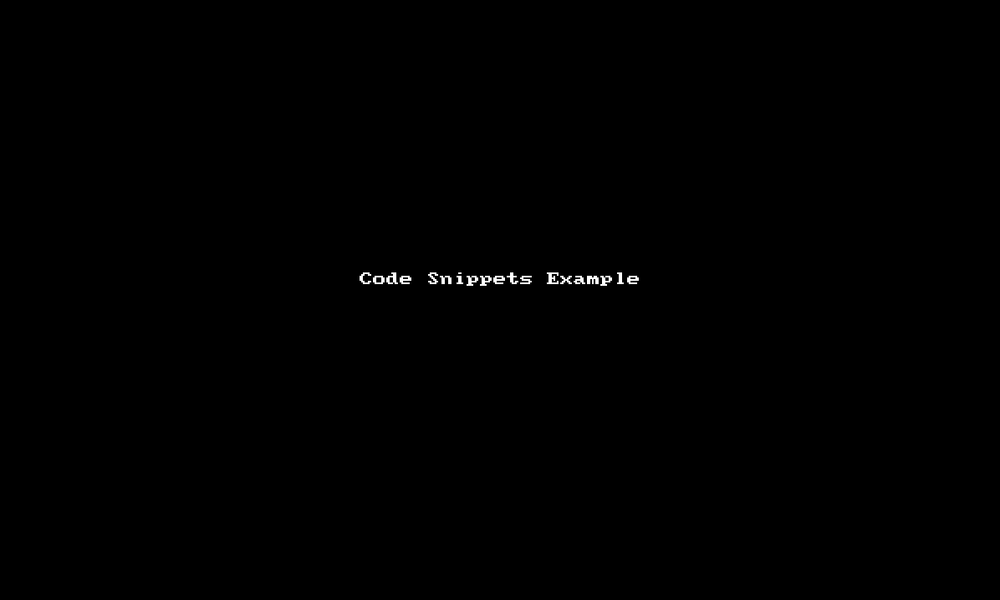

## 前言
为减少手写实现JSON和模型类相互转换的序列化、反序列化代码，我们使用了官方推荐的[json_serializable](https://github.com/dart-lang/json_serializable)方案。

同时为了解决`json_serializable`方案需要手动写为模型类写`from/to json`的代码的问题，我们引入了代码片段的解决方案。

下面将会对该方案进行具体描述。

> - 该方案同时适用于VSCode和Android Studio；
> - 下文在描述该方案时，只介绍了VSCode端的实施步骤；
> - 在Android Studio落地该方案时，只需要把涉及VSCode端的实施对等转换为Android Studio端的实施即可：比如“为VSCode添加代码片段”转换为“为Android Studio添加代码片段”。
> 

<!-- more -->

## 一、 为VSCode添加代码片段

请按照以下顺序为VSCode创建代码模板`dart_model_class.code-snippets`:

1. 打开 File -> Preferences -> User Snippets ( 在macOS上 Code -> Preferences -> User Snippets)
2. 选择 New Global Snippets file 选项，点击选择
3. 在弹窗框内输入`dart_model_class.code-snippets`，然后保存
4. 在代码编辑栏里编辑刚才创建的`dart_model_class.code-snippets`文件，输入以下内容：
   
    ``` json
	{
	  "dmc import": {
	    "prefix": "dmc import",
	    "description": "add the imports for dart model class",
	    "body": [
	      "",
	      "import 'package:json_annotation/json_annotation.dart';",
	      "part '${1:$TM_FILENAME_BASE}.g.dart';",
	      ""
	    ]
	  },
	  "from/to json": {
	    "prefix": "dmc class",
	    "description": "generate the dart model class template code",
	    "body": [
	      "@JsonSerializable()",
		  "class ${1:ClassName} {",
		  "",
		  "    // deserialize json to an instance",
		  "    factory ${1:ClassName}.fromJson(Map<String, dynamic> json) => _$${1:ClassName}FromJson(json);",
		  "    // serialize an instance to a map",
		  "    Map<String, dynamic> toJson() => _$${1:ClassName}ToJson(this);",
		  "",
		  "    // TODO: add a member for your class",
		  "",
		  "}"
	    ]
	  }
	}
	```

    
## 二、为Flutter项目添加依赖

在pubspec.yaml中添加如下依赖：

``` yaml
dependencies:
  # Your other regular dependencies here
  json_annotation: ^3.0.0

dev_dependencies:
  # Your other dev_dependencies here
  build_runner: ^1.0.0
  json_serializable: ^3.2.0
```

## 三、使用代码片段创建模型类

1. 通过代码片段`dmc import`添加依赖：

	``` dart
	/// FileName: item.dart

	import 'package:json_annotation/json_annotation.dart';
	part 'item.g.dart';

	```

2. 通过代码片段`dmc class`添加模板模型类：

	``` dart
	@JsonSerializable()
	class ClassName {

	   // deserialize json to an instance
	   factory ClassName.fromJson(Map<String, dynamic> json) => _$ClassNameFromJson(json);
	   // serialize an instance to a map
	   Map<String, dynamic> toJson() => _$ClassNameToJson(this);

	   // TODO: add your member

	}
	```
3. 编辑模板类，把`ClassName`修改你的模型类名称，并根据JSON添加对应成员，最后如下：

    ``` dart
    /// FileName: item.dart

	import 'package:json_annotation/json_annotation.dart';
	part 'item.g.dart';

	@JsonSerializable()
	class Item {

	   // deserialize json to an instance
	   factory Item.fromJson(Map<String, dynamic> json) => _$ItemFromJson(json);
	   // serialize an instance to a map
	   Map<String, dynamic> toJson() => _$ItemToJson(this);

	   // TODO: add a member for your class
	    int cout;

	    Item();
	}
    ```

完整效果可看此动图：




## 四、运行`build_runner`为所有模型类生成对应的JSON解析类


在Flutter根目录下运行`flutter packages pub run build_runner build`，为当前工程中所有所有模型类生成对应的JSON解析类。

