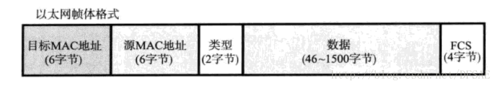

## 简介

`XDR`全称为`External Data Representation`，是一个描述和编码数据的标准。1987年由Sun公司（Sun Microsystems, Inc）发明。

`XDR`同时是一门语言，主要用来描述协议的数据格式，如[RPC](https://tools.ietf.org/html/rfc1831)、[NFS](https://tools.ietf.org/html/rfc7530)等协议就是使用它来描述自身的数据格式。

`XDR`语言只能用于描述协议的数据格式，不具有编程功能。该语言具有以下特点：

- 类似于C语言
- 描述复杂的数据格式时，相比图形描述，其更简洁

<!-- more -->

## `XDR`语法

### 分号`;`

在`XDR`语言中，分号是语句结束符。也就是说，每个语句必须以分号结束。它表明一个逻辑实体的结束。例如：

```
int a;
int b;
```

### 保留字

下表列出了`XDR`语言中的保留字。这些保留字不能作为常量名、变量名或其他标识符名称。

| 关键字   | 说明                                     |
| -------- | ---------------------------------------- |
| int      | 声明整型变量                             |
| hyper    | 声明长整型变量                           |
| unsigned | 声明无符号类型变量                       |
| float    | 声明浮点型变量                           |
| double   | 声明双精度浮点型变量                     |
| enum     | 声明枚举类型                             |
| bool     | 声明布尔类型                             |
| opaque   | 声明字节流数组类型                       |
| string   | 声明字符串类型                           |
| struct   | 声明结构体类型                           |
| union    | 声明共用体类型                           |
| switch   | 声明共用体类型和用于开关语句             |
| case     | 开关语句分支                             |
| typedef  | 用以给数据类型取别名                     |
| void     | 声明空值，声明无返回值或无参数的操作 |


### 注释

`XDR`语言有2种注释方法：

- 使用`//`注释

  ```c
  // 单行注释
  ```
  
- 使用`/* */`注释

  ```c
  /* 单行注释 */
  
  /*
    多行注释
    多行注释
    ...
  */
  ```
  
### 定义变量

定义变量的语法如下：

```
type-name variable_name = value;
```


## `XDR`数据类型

`XDR`语言提供了多种数据类型来帮助描述协议的数据格式，下面将会一一展开介绍。

### 整数类型

`XDR`语言提供的整数类型有：

| 类型                           | 存储大小     |
| ------------------------------ | ------------ |
| int（整型）                    | 4字节        |
| unsigned int（无符号整型）     | 4字节        |
| hyper（长整型）                | 8字节        |
| unsigned hyper（无符号长整型） | 8字节        |

各个整数类型定义变量的语法如下：

``` c
int a;
unsigned int b;
hyper c;
unsigned hyper d;
```

> 实例演示：
>
> ``` c
> int a = 10;
> unsigned hyper d = 10000;
>```

### 浮点数类型

`XDR`语言提供的浮点数类型有：

| 类型                   | 存储大小 | 精度      |
| ---------------------- | -------- | --------- |
| float（单精度浮点型）  | 4字节    | 6 位小数  |
| double（双进度浮点型） | 8字节    | 15 位小数 |

> `XDR`语言的浮点数类型使用的是[IEEE 754标准](https://zh.wikipedia.org/wiki/IEEE_754)。

各个浮点数类型定义变量的语法如下：

``` c
float a;
double b;
```

> 实例演示：
>
> ``` c
> float a = 1.2;
> double b = 3.402823E+38;
>```

### 枚举类型

`XDR`使用`enum`定义枚举类型，语法如下：

``` c
enum identifier { name-identifier = constant, ... } ;
```

注意：枚举成员的值的类型为`int`类型；每个枚举成员的值都是唯一的。

> 实例演示：通过枚举描述红绿蓝3种颜色
>
> ``` c
> enum color_type { 
>     RED = 1, 
>     GREEN = 2, 
>     BLUE = 3 
> } ;
>
> color_type color = RED;
>```


### 布尔类型

`XDR`使用`bool`定义布尔类型变量，语法如下：

``` c
bool identifier;
```

布尔类型只有2个值：`FALSE` 或者 `TRUE`。

> 实例演示：
>
> ``` c
> bool a = TRUE;
>```

### `Opaque Data`类型

`Opaque Data`类型主要用来描述字节流数组，它有2种类型：定长和变长`Opaque Data`类型。

`XDR`使用`opaque`声明`Opaque Data`类型。

#### 定长`Opaque Data`类型

定长`Opaque Data`类型定义变量的语法如下：

``` c
opaque identifier[n];
```

其中，`n`是一个整数常量，用于声明数组的长度。

> 如果`n`不是4的倍数，程序应对数组进行补齐操作，即在第`n`个字节后添加`r`（r 取值范围为：[0,3]）个值为0的字节，使得`(n+r) mod 4 = 0`。
>
>
> 定长`Opaque Data`类型的数据格式如下图所示：
> 
> ```
>     0        1     ...
> +--------+--------+...+--------+--------+...+--------+
> | byte 0 | byte 1 |...|byte n-1|    0   |...|    0   |
> +--------+--------+...+--------+--------+...+--------+
> |<-----------n bytes---------->|<------r bytes------>|
> |<-----------n+r (where (n+r) mod 4 = 0)------------>|
>                                              FIXED-LENGTH OPAQUE
> ```

> 实例演示：
>
> ``` c
> opaque byteBox[128];
>```

#### 变长`Opaque Data`类型

变长`Opaque Data`类型定义变量的语法如下：

``` c
opaque identifier<m>;
// or
opaque identifier<>;
```

其中，`m`是一个整数常量，用于声明数组的最大长度。

若通过第二种方式（不明确声明数组的最大长度）声明定义变量，则数组默认最大长度为：`(2^32) - 1`。

> 如果`m`不是4的倍数，程序应对数组进行补齐操作，即在第`m`个字节后添加`r`（r 取值范围为：[0,3]）个值为0的字节，使得`(m+r) mod 4 = 0`。
>
> 变长`Opaque Data`类型的数据格式如下图所示：
>
> ```
>    0     1     2     3     4     5   ...
> +-----+-----+-----+-----+-----+-----+...+-----+-----+...+-----+
> |        length n       |byte0|byte1|...| n-1 |  0  |...|  0  |
> +-----+-----+-----+-----+-----+-----+...+-----+-----+...+-----+
> |<-------4 bytes------->|<------n bytes------>|<---r bytes--->|
>                         |<----n+r (where (n+r) mod 4 = 0)---->|
>                                                   VARIABLE-LENGTH OPAQUE
> ```
>
> 其中，数组前4个字节声明了数组的真实长度（有效数据长度）。

> 实例演示：
>
> ``` c
> opaque byteBox<>;
>```

### 字符串类型

字符串类型主要用来描述ASCII字符数组，它是变长数据类型。

`XDR`使用`string`定义字符串类型变量，语法如下：

```c
string object<m>;
//or
string object<>;
```

其中，`m`是一个整数常量，用于声明数组的最大长度。

若通过第二种方式（不明确声明数组的最大长度）定义字符串类型变量，则数组默认最大长度为：`(2^32) - 1`。


> 如果`m`不是4的倍数，程序应对数组进行补齐操作，即在第`m`个字节后添加`r`（r 取值范围为：[0,3]）个值为0的字节，使得`(m+r) mod 4 = 0`。
>
> 字符串类型的数据格式如下图所示：
>
> ```
>    0     1     2     3     4     5   ...
> +-----+-----+-----+-----+-----+-----+...+-----+-----+...+-----+
> |        length n       |byte0|byte1|...| n-1 |  0  |...|  0  |
> +-----+-----+-----+-----+-----+-----+...+-----+-----+...+-----+
> |<-------4 bytes------->|<------n bytes------>|<---r bytes--->|
>                         |<----n+r (where (n+r) mod 4 = 0)---->|
>                                                          STRING
> ```
>
> 其中，数组前4个字节声明了数组的真实长度（有效数据长度）。

> 实例演示：
>
> ``` c
> string asciiBox<>;
>```

### 数组类型

数组类型主要用来描述已知的数据类型的元素数组，它有2种类型：定长和变长数组类型。

> 在数组中，每个元素的长度都是4的倍数。
>
> 数组每个元素的数据类型相同，但是它们的长度却不一定相同，比如字符串数组。

#### 定长数组类型

定长数组类型定义变量的语法如下：

``` c
type-name identifier[n];
```

其中，`n`是一个整数常量，用于声明数组的长度。

> 定长数组类型的数据格式如下图所示：
> 
> ```
>  +---+---+---+---+---+---+---+---+...+---+---+---+---+
>  |   element 0   |   element 1   |...|  element n-1  |
>  +---+---+---+---+---+---+---+---+...+---+---+---+---+
>  |<--------------------n elements------------------->|
>                                       FIXED-LENGTH ARRAY
> ```

> 实例演示：
>
> ``` c
> string strList[10];
>```

#### 变长数组类型

变长数组类型定义变量的语法如下：

``` c
type-name identifier<m>;
// or
type-name identifier<>;
```

其中，`m`是一个整数常量，用于声明数组的最大长度。

若通过第二种方式（不明确声明数组的最大长度）定义变量，则数组默认最大长度为：`(2^32) - 1`。

> 变长数组类型的数据格式如下图所示：
>
> ```
>   0  1  2  3
> +--+--+--+--+--+--+--+--+--+--+--+--+...+--+--+--+--+
> |     n     | element 0 | element 1 |...|element n-1|
> +--+--+--+--+--+--+--+--+--+--+--+--+...+--+--+--+--+
> |<-4 bytes->|<--------------n elements------------->|
>                                                 COUNTED ARRAY
> ```
>
> 其中，数组前4个字节声明了数组的真实长度（有效数据长度）。

> 实例演示：
>
> ``` c
> string strList<>;
>```

### 结构体类型

结构体类型主要用于描述自定义的数据对象类型。

`XDR`使用`struct`定义结构体类型，语法如下：

``` c
struct identifier {
   component-declaration-A;
   component-declaration-B;
   ...
};
```

注意：结构体中的成员可以是不同的数据类型，但是成员的长度都应该是4的倍数。

> 实例演示：
>
> ``` c
> struct msg {
> unsigned int id;
> string body<>;
> };
> ``
> ```

### 共用体类型

共用体类型主要用于描述“根据不同条件返回不同数据类型”的数据类型。

`XDR`使用`union switch`定义共用体类型，语法如下：

``` c
 union switch (discriminant-declaration) {
 case discriminant-value-A:
    arm-declaration-A;
 case discriminant-value-B:
    arm-declaration-B;
 ...
 default: default-declaration;
 } identifier;
```

注意：每个`case`关键字后面都需要跟着一个合法的判断值。`default`语句是可选的。

> 实例演示：根据颜色返回字节流数组或者结构体或者空的数据类型。
> 
> ```c
> union switch (color_type color) {
>     case RED:
>        opaque results[0];
>     case BLUE:
>        struct {
>        	unsigned int hex;
>        } info;
>     default:
>        void;
>  } 
> ```

### Void

`XDR`使用`void`代表空。用于描述无值的情况，或者用于描述不接受数据作为输入或不接受数据作为输出的操作。

### Constant

`XDR`使用`const`为字面量定义一个符号名称，语法如下：

```
const name-identifier = n;
```

> 实例演示：在下面的例子中，`pi`这个符号常量等同于整数常量3.14159。
> 
> ```c
> const pi = 3.14159;
> ```

### Typedef

`XDR`使用`typedef`为已声明的数据类型定义一个新标识符。

需要注意的是，在不同场景下，为已声明的数据类型定义一个新标识符会有不同的语法：

- 为`struct`、`union`、`enum`数据类型定义新标识符

  ```
  typedef <<struct, union, or enum definition>> identifier;
  ```

	>   实例演示：例如定义`bool`类型。
	> 
	>   ```c
	>   typedef enum {    /* using typedef */
	>             FALSE = 0,
	>             TRUE = 1
	>          } bool;
	> 
	>   // or
	> 
	>   enum bool {       /* preferred alternative */
	>     FALSE = 0,
	>     TRUE = 1
	>   };
	>   ```

- 为数组类型定义新标识符

  ```
  typedef type_name identifier[n];
  ```

	> 实例演示：定义一个int数组。
	> 
	> ```c
	> typedef int byteBox[1024]; 
	> ```
	>
	> 这时候，下面定义`kb`变量2种方式都是可以的。
	> 
	> ```c
	> byteBox kb;
	> // or
	> int    kb[1024];
	> ```

- 为其他数据数据类型定义新标识符

  ```
  typedef type_name identifier;
  ```

	> 实例演示：定义一个`byte`类型。
	>   
	> ```
	> typedef int byte; 
	> ```
  
### `Optional-data`类型

`Optional-data`类型用于描述值可能为空（`void`）的数据类型。它相当于`C`语言中的指针。

`Optional-data`类型定义变量的语法如下：

```
type-name *identifier;
```

## 使用`XDR`描述协议

下面将会通过一个小案例演示`XDR`是如何描述协议的数据格式的。

下图为以太网协议中“帧”的数据格式：



我们现在使用`XDR`描述进行描述：

```c
struct frame {
	opaque d_mac[6];
	opaque s_mac[6];
	opaque type[2];
	opaque data<1500>;
	opaque fcs[4];
}
```


