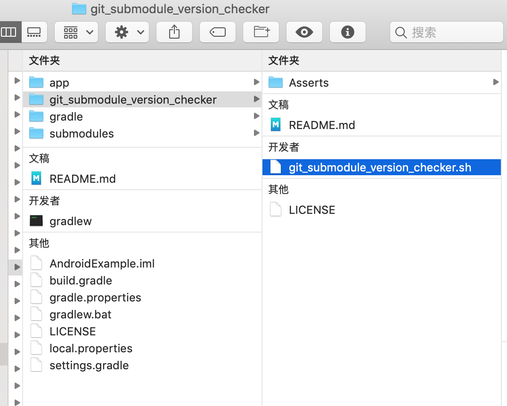

## 背景

最近项目由于一些特殊需要，使用了git的submodules工具来引入一个子项目到主项目中。然而考虑submodules工具在团队协作开发的过程中，容易出现子项目版本不一致的问题，于是研发了[git_submodule_version_checker](https://github.com/YK-Unit/git_submodule_version_checker)这款工具来解决。

> 1、关于git的submodules工具的介绍可以点击阅读[《Git 工具 - 子模块》](https://git-scm.com/book/zh/v2/Git-%E5%B7%A5%E5%85%B7-%E5%AD%90%E6%A8%A1%E5%9D%97)。
>
> 2、关于git的submodules工具的优缺点，有兴趣的请直接Google吧，目前网上已经很多资料了。总得来说，其最大的（可能也是唯一的）优点是：允许开发者将一个子项目的git仓库作为主项目git 仓库的子目录，并让子项目保持提交的独立；而其突出的缺点主要有以下几个：
> - 主项目仓库不记录子项目仓库的文件变动，只记录子项目仓库的commitId，在这个背景下，团队协作开发过程中容易产生子项目版本不一致的问题，具体表现如下：
>
>    - 团队协作开发时，若有成员更新了子项目，但是你`git pull`后，却没有运行`git submodule update --remote`更新子项目本地仓库，那么你极有可能再次把旧的子项目版本信息（子项目仓库依然指向一个旧的commitId）提交至主项目
>    - 团队协作开发时，若你在本地改动了子项目，并在主项目中提交并推送了子项目版本信息，但却没有推送子项目仓库上的改动，这时其他成员在拉取更新后，运行`git submodule update`时，会遇到“找不到所引用的子模块提交”的错误提示
>  - 每次更新子项目仓库，子项目仓库都会回到游离状态，在这个背景下， 会产生的问题有：
>    - 若你已经切换到指定分支，在更新后，需要手动切换分支；
>    - 若你对子项目做了修改，但是忘记了提交，这时候执行更新，会导致修改被丢失；
>
> - 子项目仓库总是需要手动更新（不过可以通过自动化工具编写帮助解决此问题）


## git_submodule_version_checker

[git_submodule_version_checker](https://github.com/YK-Unit/git_submodule_version_checker)工具使用shell编写，其检测判断一个子项目的版本是否一致的思路如下：

1. 获取当前子项目的本地仓库当前指向的commitId：`submodules_head_commit_id`

    ``` shell
    git submodule status `{pwd}`/SUBMODULE_PATH | awk '{print $1}'
    ```

2. 获取主项目记录的当前子项目的版本commitId：`submodules_associated_commit_id`

    ``` shell
    git ls-tree master `{pwd}`/SUBMODULE_PATH | awk '{print $3}'
    ```

3. 判断`submodules_associated_commit_id`是否为空，若为空，说明当前子项目为新增子模块，需要提示开发者在主项目中进行提交；若不为空，则将2个commitId进行比较，若二者一致，则说明当前子项目的版本是一致的

具体代码如下：

``` shell
#!/bin/sh  

function check_submodules_version()
{
	# echo -e "\033[字背景颜色;字体颜色m 字符串 \033[0m"
	color_prefix_red="\033[0;31m"
	color_suffix="\033[0m"

	project_dir=$1
	cd $project_dir
	color_project_dir=$color_prefix_red$project_dir$color_suffix
	echo "cd to repo '$color_project_dir' done"

	echo "check the version of submodules now ..."

	cur_branch=$(git symbolic-ref --short -q HEAD)
	#echo "current branch: $cur_branch"

	temp_has_bad_submodule="$project_dir/.temp_has_bad_submodule"
	rm -f temp_has_bad_submodule
	touch temp_has_bad_submodule

	echo "Here is the all submodules:"

	git submodule status | while read -r line
	do 
		# 1. 获取当前子项目的本地仓库当前指向的commitId：submodules_head_commit_id
		eval `echo $line | awk '{
	    	printf("submodules_head_commit_id=%s; submodule_name=%s", $1, $2)
		}'`
		#echo "$submodule_name: $submodules_head_commit_id" 

		# gradle 执行 'git submodule status' 时，submodule_name 前面带有 '../'，非常奇怪
		# 这个正是用于删除 '../'
		if [[ $submodule_name == ../* ]]
		then
			submodule_name=${submodule_name:3}
		fi

		# 2. 获取主项目记录的当前子项目的版本commitId：submodules_associated_commit_id
		submodule_path="$project_dir/$submodule_name"
		eval `git ls-tree $cur_branch $submodule_path  | awk '{
	    	printf("submodules_associated_commit_id=%s", $3)
		}'`

		color_submodules_associated_commit_id=$color_prefix_red$submodules_associated_commit_id$color_suffix
		color_submodules_head_commit_id=$color_prefix_red$submodules_head_commit_id$color_suffix

		color_tips=$color_prefix_red"[★]"$color_suffix
		color_right=$color_prefix_red"[✓]"$color_suffix
		color_wrong=$color_prefix_red"[✗]"$color_suffix

		# 3. 判断`submodules_associated_commit_id`是否为空，若为空，说明当前子项目为新增子模块，需要提示开发者在主项目中进行提交；
		#    若不为空，则将2个commitId进行比较，若二者一致，则说明当前子项目的版本是一致的
		if [ -z "$submodules_associated_commit_id" ]
		then
			echo "$color_tips $submodule_name: a new submodule, and is waiting to be committed"
		else
			if [ $submodules_associated_commit_id = $submodules_head_commit_id ]
			then 
				echo "$color_right $submodule_name: associatedCommitId($color_submodules_associated_commit_id) == headCommitId($color_submodules_head_commit_id)"
			else 
				echo "$color_wrong $submodule_name: associatedCommitId($color_submodules_associated_commit_id) != headCommitId($color_submodules_head_commit_id)"
				echo true > temp_has_bad_submodule
			fi
		fi

	done

	read has_bad_submodule < temp_has_bad_submodule
	rm -f temp_has_bad_submodule

	echo "check the version of submodules done !!!"

	if [ "$has_bad_submodule" = true ]
	then
		fix_cmd="git submodule update --init --recursive"
		color_fix_cmd=$color_prefix_red$fix_cmd$color_suffix
		color_sad=$color_prefix_red"(ToT)"$color_suffix
		echo "$color_sad This main repo has bad submodules, please run this command to fix it: $color_fix_cmd"
		# 1 = false
    	return 1
	else
		color_happy=$color_prefix_red"(^_^)"$color_suffix
		echo "$color_happy This main repo has good submodules, you can have a joy now..."
    	# 0 = true
    	return 0
	fi
}

# test: 假设git_submodule_version_checker.sh脚本放置在主工程git仓库根目录下的一个文件夹，如./script/git_submodule_version_checker.sh
#project_dir=$(cd `dirname $0`; cd ..; pwd)
if [ -n "$1" ]
then
    project_dir=$1
else
	echo "usage: sh PATH_TO/git_submodule_version_checker.sh PATH_TO_MAIN_GIT_REPO "
	exit 1
fi

check_submodules_version $project_dir

```

## 如何接入到移动端项目

下面将会通过iOS端和Android端的示例工程，演示如何接入`git_submodule_version_checker`到移动端主项目工程中。

### 关于检测工具的运行时机

在iOS端和Android端项目的示例工程中，`git_submodule_version_checker`的运行时机都设置在工程编译前，你也可以根据自己需要调整你喜欢的运行时机。

在iOS端和Android端项目的示例工程中，每次对工程进行编译前，都会调用`git_submodule_version_checker`对子项目的版本进行检查，若当前主项目存在版本不一致的子项目，则编译会以失败结束。

### iOS端示例

iOS端主项目工程接入步骤如下：

1. 下载[git_submodule_version_checker](https://github.com/YK-Unit/git_submodule_version_checker/archive/master.zip)，放置到主工程根目录，如图：

    

2. 用Xcode打开主工程的，选择`主工程Target > Build Phase > + `，如图所示新建一个名为`[CP] Check Git Submodule Version`的`Run Script Phase`：

    

   

   - `Run Script Phase`代码：

      ``` shell
      root_dir=$SRCROOT
      sh $root_dir/git_submodule_version_checker/git_submodule_version_checker.sh $root_dir
      if [ $? != 0 ]
      then 
      echo "error: This main repo has bad submodules, please run 'git submodule update --init --recursive' to fix it" >&2
      exit 1
      fi
      echo "SUCCESS"
      
      ```

   - 注意和红框一样，反选`Show environment variables in build log`和`Run script only when installing`


### Android端示例

Android端主项目工程接入步骤如下：
1. 下载[git_submodule_version_checker](https://github.com/YK-Unit/git_submodule_version_checker/archive/master.zip)，放置到主工程根目录，如图：

    


2. 用Android Studio 打开主工程，选择`主工程 > app > build.gradle `，如图所示添加名为`check_git_submodule_version`的`task`，并为`preBuild`这个task设置依赖：

    

   上述添加的完整代码如下：

   ```groovy
   task check_git_submodule_version(type: Exec) {
       def root_dir = getRootDir()
       executable "sh"
       args "$root_dir/git_submodule_version_checker/git_submodule_version_checker.sh", "$root_dir"
   
       ignoreExitValue true
   
       doLast {
           logger.lifecycle("check result: $execResult")
   
           if(execResult.exitValue == 0) {
               logger.lifecycle('SUCCESS')
           } else {
               throw new GradleException("This main repo has bad submodules, please run \'git submodule update --init --recursive\' to fix it.")
           }
       }
   
   }
   
   preBuild.dependsOn check_git_submodule_version
   ```

### 示例链接

- [iOS Example](https://github.com/YK-Unit/git_submodule_version_checker_example_iOS)
- [Android Example](https://github.com/YK-Unit/git_submodule_version_checker_example_Android)


## 参考资料

- [《How can I get a git submodule's associated commit ID from a past commit in the parent clone?》](https://stackoverflow.com/questions/3983829/how-can-i-get-a-git-submodules-associated-commit-id-from-a-past-commit-in-the-p?noredirect=1&lq=1)
- [《Git 工具 - 子模块》](https://git-scm.com/book/zh/v2/Git-%E5%B7%A5%E5%85%B7-%E5%AD%90%E6%A8%A1%E5%9D%97)
- [《Git submodule的坑》](https://blog.devtang.com/2013/05/08/git-submodule-issues/)


