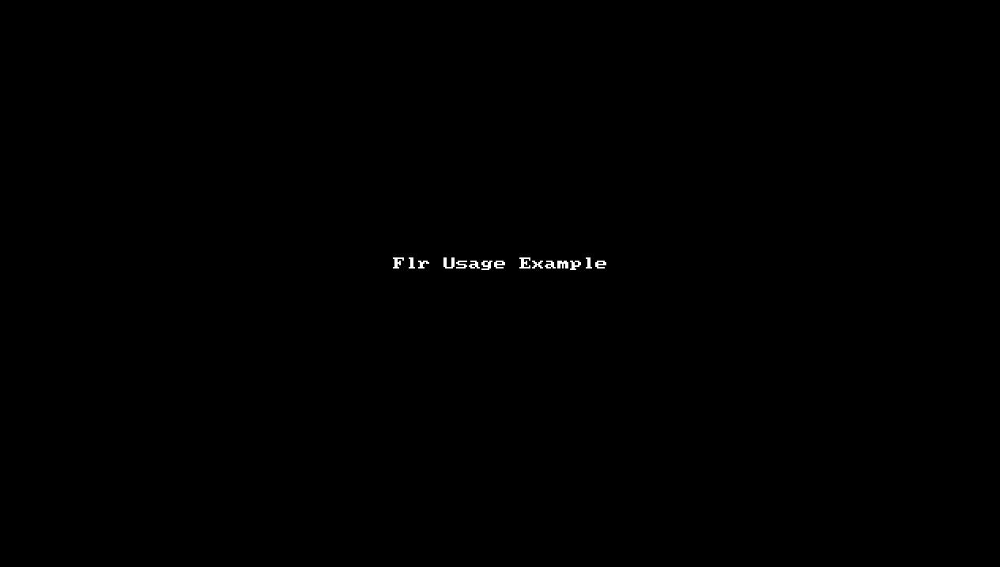
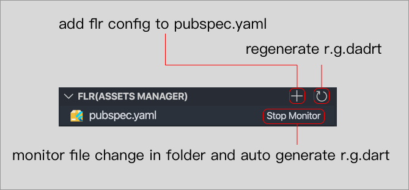

## 前言
作为一名Flutter开发者，如果你正在烦恼如何简单快捷地在`pubspec.yaml`中为多张图片、文本、字体资源添加声明，如果你正在烦恼如何简单安全地在代码中引用资源，那么现在你可以很简单地解决这些问题了——只要你使用了`Flr`。

## Flr简介

`Flr`，读作`Flutter-R`，是一个由网易严选智造团队研发的，用于管理Flutter资源的开发工具。

`Flr`可以帮助Flutter开发者在修改项目资源后，自动为资源添加声明到`pubspec.yaml`以及生成`r.g.dart`文件。借助`r.g.dart`，Flutter开发者可以在代码中通过资源ID函数的方式应用资源，例如：

<!-- more -->

``` dart 
import 'package:flutter_r_demo/r.g.dart';

// test_sameName.png
var normalImageWidget = Image(
  width: 200,
  height: 120,
  image: R.image.test_sameName(),
);

// test_sameName.gif
var gifImageWidget = Image(
  image: R.mage.test_sameName_gif(),
);

// test.svg
var svgImageWidget = Image(
  width: 100,
  height: 100,
  image: R.svg.test(width: 100, height: 100),
);

// test.json
var jsonString = await R.text.test_json();

// test.yaml
var yamlString = await R.text.test_yaml();

// Amiri Font Style
var amiriTextStyle = TextStyle(fontFamily: R.fontFamily.amiri);
```

## Flr特性

截止到目前，`Flr`已经支持以下特性：
- 支持“自动添加资源声明到 `pubspec.yaml` 和自动生成`r.g.dart`文件”的自动化服务，该服务可以通过手动触发，也可以通过监控资源变化触发
- 支持`R.x`（如 `R.image.test()`，`R.svg.test(width: 100, height: 100)`，`R.txt.test_json()`）的代码结构
- 支持处理图片资源（ `.png`、 `.jpg`、 `.jpeg`、`.gif`、 `.webp`、`.icon`、`.bmp`、`.wbmp`、`.svg` ）
- 支持处理文本资源（`.txt`、`.json`、`.yaml`、`.xml`）
- 支持处理字体资源（`.ttf`、`.otf`、`.ttc`）
- 支持处理[图片资源变体](https://flutter.dev/docs/development/ui/assets-and-images#asset-variants)
- 支持处理带有坏味道的文件名的资源：
	- 文件名带有非法字符，如空格、`~`、`#` 等（非法字符是指不在合法字符集合内的字符；合法字符集合的字符有：`0-9`、`A-Z`、 `a-z`、 `_`、`+`、`-`、`.`、`·`、 `!`、 `@`、 `&`、`$`、`￥`）
	- 文件名以数字或者`_`或者`$`字符开头
- 支持处理文件名相同但路径不同的资源

## Flr工具

为了更好地满足Flutter开发者的使用需求，我们提供了以下3个版本的`Flr`工具：

1. **Flr Android Studio Plugin** 版本
  
   - GitHub:  https://github.com/Fly-Mix/flr-as-plugin
   - Plugin Homepage: https://plugins.jetbrains.com/plugin/13789-flr
   - flr-as-plugin Usage Example Gif: 

     

1. **Flr CLI** 版本
   
   - GitHub: https://github.com/Fly-Mix/flr-cli
   - CLI Homepage: https://rubygems.org/gems/flr
   - flr-cli Usage Example Gif:
   
     

1. **Flr VSCode Extension** 版本
   
   - GitHub: https://github.com/Fly-Mix/flr-vscode-extension
   - Extension Homepage: https://marketplace.visualstudio.com/items?itemName=LincolnLaw.flr
   - flr-vscode-extension Usage Example:

     

最后，希望该工具可以帮助各个Flutter开发者提升Flutter的开发效率。使用过程中有任何疑问，欢迎通过GitHub或者邮件反馈给我们。
