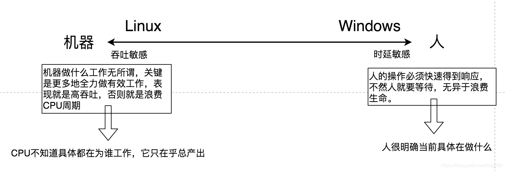

## 在产品层面，Windows与Unix/Linux的区别

在产品层面上，Windows与Unix/Linux的区别主要体现在二者服务的对象和应用场景上：

- Windows系统的服务对象主要是（或者说优先是）个人计算机用户，主要用于为个人计算机用户提供办公（如文档编写、画图）、娱乐（上网浏览、视频播放）、沟通（IM聊天）等服务。
- Unix/Linux系统服务对象主要是（或者说优先是）企业用户，主要为企业用户提供计算任务的服务，如网络访问服务、数据生成、数据存储等。

在人机关联层面上，，Windows与Unix/Linux的区别主要体现在二者与人和机器的关联程度上：

- Windows系统更靠近人这一端，其优先考虑人的操作行为，并在系统设计上优先考虑适应人的操作行为，从而为人操作机器时提供良好的短时延服务
- Unix/Linux系统更靠近机器这一端，其优先考虑的是多个计算任务的运行，然后在系统设计上优先考虑CPU运行多个计算任务的高效性，从而为客户端提供最大的数据吞吐

在桌面系统层面上，Windows是一个桌面系统，Unix/Linux则不是一个桌面系统。

<!-- more -->

## 为什么在GUI场景中，Windows比Unix/Linux操作流畅 

产品理念的不同，导致Windows系统和Unix/Linux系统在进行GUI设计和进程调度设计时，采取了不同的设计方案，而方案的不同，导致了在GUI场景下Windows比Unix/Linux操作流畅的结果。

在GUI设计方面：

- Windows系统：GUI程序是一个系统级别的“应用程序”，其是直接集成在系统层面，属于系统的一部分。
- Unix/Linux系统：GUI程序是一个应用层级别的独立的程序。

在进程调度设计方面：
- Windows系统的进程调度设计优先考虑了用户的操作行为，把进程的动态优先级和交互事件做了强关联。
- Unix/Linux系统在进程调度设计上，把进程的动态优先级和交互事件做的是弱关联，即交互事件对进程的优先级提高的影响占比很低。

简单来说，相比Unix/Linux系统，Windows系统优先响应交互事件。

## 参考资料

- [《为什么Windows/iOS操作很流畅而Linux/Android却很卡顿呢》](https://blog.csdn.net/dog250/article/details/96362789)
- [《Linux桌面GUI系统的调度器应该怎么做才不卡顿呢？》](https://blog.csdn.net/dog250/article/details/96500186)

