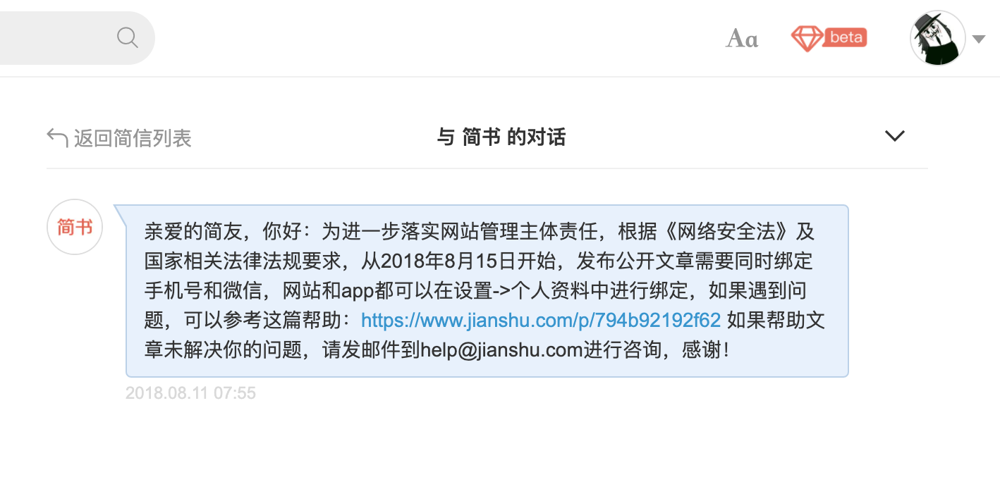
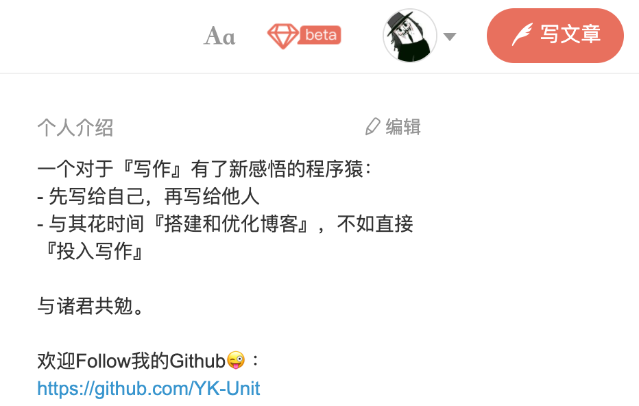

为何重启个人博客？

这个问题很早就想发文表达了，如今时机终于到了——在这个人博客重建完毕的时候，可以好好的来对此说说了。

重启个人博客的念头源自18年8月简书创作平台发的一则公告：

翻阅《网络安全法》，并没有出现要求绑定“微信”的明文要求，而行业内，“网络运营者”（使用国法里的称法）的常规做法也只是要求用户绑定手机号即可——很明显地，简书这是在假借国法，浑水摸鱼，愚弄用户。

坦白而言，简书是我很喜欢的一个写作平台，它的优秀写作体验，甚至让我做了停止搭建个人博客，专注于写作本身的决定——这在当时的简书个人介绍上可见一斑：

然而，甚是没想到简书对用户如此毫无尊重和敬畏，所以在那之后，决定了迁移到[掘金](https://juejin.im/user/569db819816dfa005959d881)上进行写作。

那，既然已经有另一个平台供写作了，为何还是要重启个人博客呢？

为何“要”呢？

人生来之时是善还是恶，这无法定论。但是，人生来之后，却无法保证自身不作恶。平台是人搭建的，自是平台也无法保证自身不作恶。所以必须重启个人博客，对自己的文章进行备份，以在所寄身的写作平台在作恶之时，有路可退。

