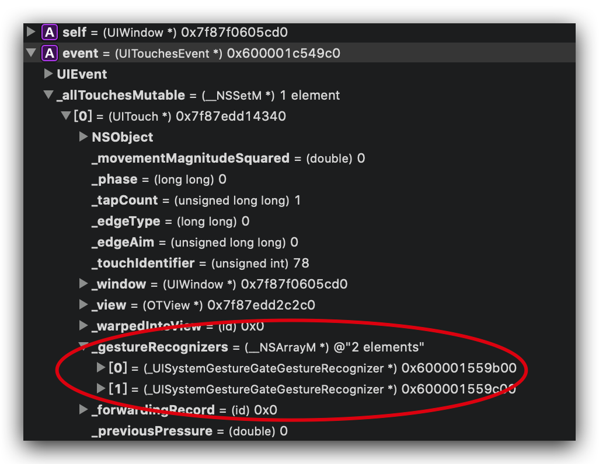
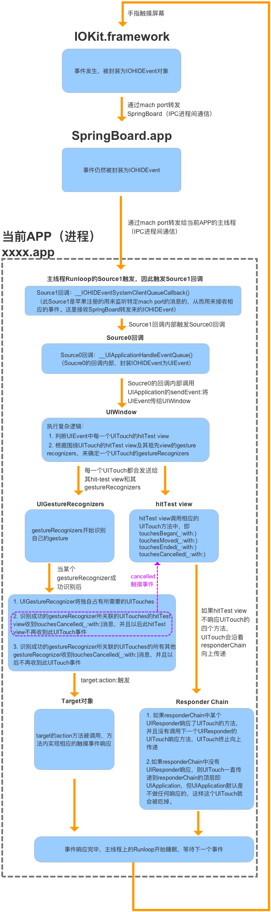
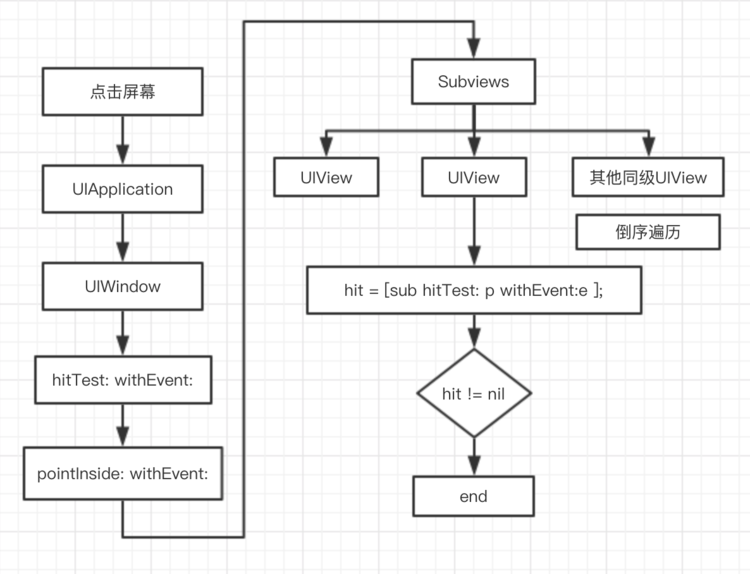
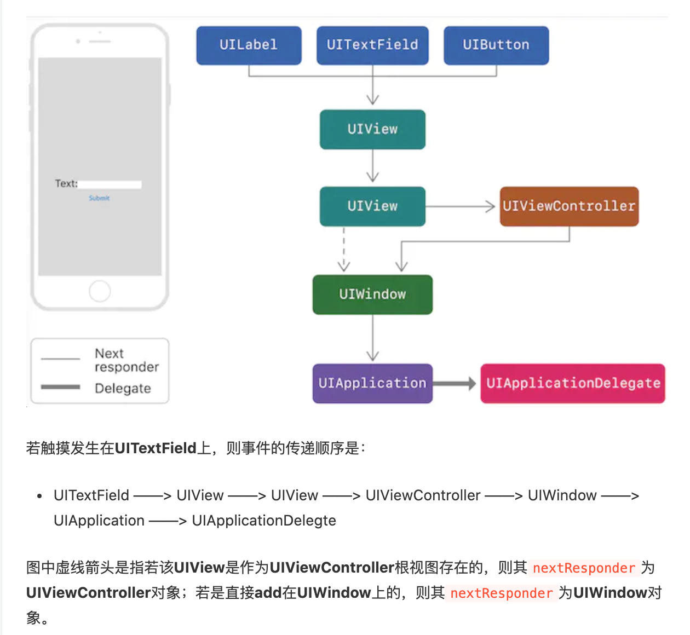
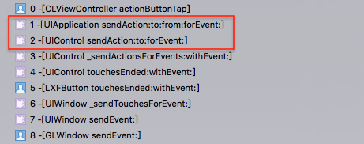

## 前言

当App启动后，用户第一次点击App内的一个视图，这时候将会产生一个点击事件。

下面将会讲述这点击事件背后的相关知识点，比如：

- 点击事件如何从硬件层传递到App
- App如何查找到最佳响应者（hit-tested view）
- App查找到最佳响应者（hit-tested view）后，如何把点击事件传递给最佳响应者（hit-tested view）
- 最佳响应者（hit-tested view）作为第一响应者（first responder），如何对事件进行响应和传递？
- 异常场景的冲突解决
    - 手势与点击冲突
    - 多个手势冲突
    - 让多个UIView响应同一个点击事件

## iOS设备事件的类型

- Touch Events(触摸事件)
- Motion Events(运动事件，比如重力感应和摇一摇等)
- Remote Events(远程事件，比如用耳机上得按键来控制手机)

## 可以处理触摸事件的类有哪些

- UIResponder的子类（UIApplication，UIWindow，UIViewController和UIView）
- UIGestureRecognizer的子类
- UIControl的子类（UIButton，UISegmentedControl，UISwitch）

> - UIResponder是iOS中用于处理用户事件的API，可以处理触摸事件、按压事件(3D touch)、远程控制事件、硬件运动事件。 可以通过touchesBegan、pressesBegan、motionBegan、remoteControlReceivedWithEvent等方法，获取到对应的回调消息。UIResponder不只用来接收事件，还可以处理和传递对应的事件，如果当前响应者不能处理，则转发给其他合适的响应者处理。
> - UIConotrol是UIView（UIResponder）的子类，相比于UIResponder，其增加了target-action的特别设计。

## UIConotrol、UIGestureRecognizer、 UIResponder的触摸事件响应优先级排名 

- UIResponder优先级最低
- UIConotrol的优先级大于其父视图上UIGestureRecognizer，小于添加在其自身上的UIGestureRecognizer

## 触摸事件如何从硬件层转发到App

1. 触摸发生时，系统内核生成触摸事件，然后交由给IOKit进程
2. IOKit进程把触摸事件封装成IOHIDEvent对象，通过IPC（mach port）发送给SpringBoard进程。
2. SpringBoard进程通过IPC（mach port）发送IOHIDEvent对象给当前App进程。

    > 需要注意的是，若当前前台无App运行，则SpringBoard进程会把该IOHIDEvent对象发送给桌面系统处理。
    
3. App进程的mach port收到IOHIDEvent后，会唤醒主线程的runloop，触发source1回调；source1回调又触发一个source0回调，将接收到的IOHIDEvent对象封装成UIEvent对象，发送给App进程的UIApplication对象处理。

## UIApplication收到触摸事件（UIEvent）后的处理流程

1. UIApplication对象通过 `hit-tesing` 机制查找最佳响应视图（`hit-tested view`）。

1. 确定触摸事件的第一响应者（first-responder）——一般情况下，最佳响应视图（hit-tested view）将会是触摸事件的第一响应者（first-responder）。

    具体地，根据最佳响应视图（`hit-tested view`）的类型和既定的UIConotrol、UIGestureRecognizer、 UIResponder的触摸事件响应优先级排名 ，确定第一响应者（first-responder）：
    
    - `hit-tested view`是UIControl类型，`hit-tested view`自身没有UIGestureRecognizer，则第一响应者是`hit-tested view`
    - `hit-tested view`是UIControl类型，`hit-tested view`自身有UIGestureRecognizer，则第一响应者是`hit-tested view`上的UIGestureRecognizer，第二响应者是`hit-tested view`
    - `hit-tested view`是UIResponder类型，`hit-tested view`自身和其后面的响应者视图上都没有UIGestureRecognizer，则第一响应者是`hit-tested view`
    - `hit-tested view`是UIResponder类型，`hit-tested view`自身或者和其后面的响应者视图上有UIGestureRecognizer，则第一响应者是`hit-tested view`上或者和其后面的响应者视图上的UIGestureRecognizer，第二响应者是`hit-tested view`

    > 在进行`hit-tesing`过程中，`UIEvent`会收集这过程发现的`UIGestureRecognizer`到它的`_allTouchesMutable-_gestureRecognizers`中
    >
    > 
    >
    > 
    
1. UIApplication对象通过`sendEvent:`把触摸事件（UIEvent）发送给第一响应者（first-responder）或者最佳响应视图（hit-tested view）；最佳响应视图（hit-tested view）收到事件后会沿着其响应链决策处理该触摸事件（UIEvent）。

    具体地，UIApplication对象将事件通过`sendEvent:` 传递给事件所属的UIWindow对象，UIWindow对象根据第一响应者的类型，采用不同的逻辑使用 `sendEvent:`把触摸事件分发给发送给第一响应者（first-responder）或者最佳响应视图（hit-tested view）：
    
    - 若第一响应者（first-responder）是最佳响应视图（hit-tested view），则事件直接发送给最佳响应视图（hit-tested view）
    - 若第一响应者（first-responder）UIGestureRecognizer，则最佳响应视图（hit-tested view）是第二响应者，然后事件会先发给UIGestureRecognizer，再发给最佳响应视图（hit-tested view）；UIGestureRecognizer收到事件后，会开始对事件进行识别，识别过程中，事件会继续分发给最佳响应视图（hit-tested view）；当UIGestureRecognizer识别出事件为其对应的手势后会触发`target-action`调用，并且事件将停止分发给最佳响应视图（hit-tested view）
    
    > 手势识别过程中或者识别成功后，可分别通过设置UIGestureRecognizer的`delaysTouchesBegan`属性和`cancelsTouchesInView`属性来控制是否分发事件给最佳响应视图（hit-tested view）

    

## `hit-tesing` 机制是什么



1. 当手指接触屏幕，UIApplication接收到手指的触摸事件之后，就会去调用UIWindow的`hitTest: withEvent:`方法

    > 如果存在多个UIWindow，则从KeyWindow开始遍历UIWindow数组

2. 在`hitTest: withEvent:`方法中会调用`pointInside: withEvent:`去判断当前点击的point是否属于UIWindow范围内，如果是，就会以倒序的方式遍历它的子视图，即越后添加的视图，越先遍历
3. 子视图也调用自身的`hitTest: withEvent:`方法，来查找最佳响应视图，若某个子视图就是最佳响应视图，则返回该子视图；若最终没有任何一个子视图是最佳响应视图，就返回nil

## `hitTest: withEvent:`方法的内部逻辑

1. 判断当前视图是否满足响应条件：

    - 可交互： `userInteractionEnabled = YES`
    - 非隐藏：`hidden = NO`
    - 透明度大于0：`alpha > 0.01`
    - 触摸点的位置在视图范围内：通过`pointInside: withEvent:`方法判断触摸点是否在视图的坐标范围内

2. 若满足响应条件，则倒序遍历其子视图查找最佳响应视图，若存在更何时的子视图，就返回子视图，否则返回自身

具体代码逻辑如下：

``` objc
- (UIView *)hitTest:(CGPoint)point withEvent:(UIEvent *)event {
    //3种状态无法响应事件
    if (!self.isUserInteractionEnabled || self.isHidden || self.alpha <= 0.01) {
        return nil;
    }
    
     //触摸点若不在当前视图上则无法响应事件
    if ([self pointInside:point withEvent:event]) {
         //从后往前遍历子视图数组
        for (UIView *subView in [self.subviews reverseObjectEnumerator]) {
            // 坐标系的转换,把触摸点在当前视图上坐标转换为在子视图上的坐标
            CGPoint convertedPoint = [subView convertPoint:point fromView:self];
             //询问子视图层级中的最佳响应视图
            UIView *hitTestView = [subView hitTest:convertedPoint withEvent:event];
            if (hitTestView) {
                 //如果子视图中有更合适的就返回
                return hitTestView;
            }
        }
         //没有在子视图中找到更合适的响应视图，那么自身就是最合适的
        return self;
    }
    
    return nil;
}

```

## 响应链是什么

响应链是一个以第一响应者对象为起点，以AppDelegate对象为终点，以响应者对象（UIResponder对象）的`nextResponder`属性作为连接上一个和下一个响应者对象工具的，一个单向的，响应者对象链条。

> 每一个响应者对象（UIResponder对象）都有一个`nextResponder`属性，用于获取响应链中当前对象的下一个响应者。因此，一旦事件的最佳响应者确定了，这个事件所处的响应链就确定了。

## 响应者对象的`nextResponder`是什么

不同响应者对象（`UIView`、`UIViewController`、`UIWindow`、`UIApplication`），其默认的`nextResponder`实现如下：

- UIView

    若视图是控制器的根视图，则其`nextResponder`为控制器对象；否则，其`nextResponder`为父视图。
- UIViewController

    若控制器的视图是window的根视图，则其`nextResponder`为窗口对象；若控制器是从别的控制器present出来的，则其`nextResponder`为presenting view controller。
    
- UIWindow

    `nextResponder`为UIApplication对象。
    
- UIApplication

    若当前应用的app delegate是一个UIResponder对象，且不是UIView、UIViewController或app本身，则UIApplication的nextResponder为app delegate。

官网对于响应链的示例展示:



## UIResponder类型响应者如何处理触摸事件？

UIResponder类型响应者对于接收到的事件有3种操作：

- 不拦截，默认操作：事件会自动沿着默认的响应链往下传递
- 拦截，不再往下分发事件：重写 `touchesBegan:withEvent:` 进行事件处理，不调用父类的 `touchesBegan:withEvent:`
- 拦截，继续往下分发事件：重写 `touchesBegan:withEvent:` 进行事件处理，同时调用父类的 `touchesBegan:withEvent:` 将事件往下传递

## UIControl类型响应者如何处理触摸事件？

UIControl是UIResponder的子类，其内部重写了touch相关的方法，当其收到触摸事件后，会对事件进行识别，若符合响应条件，会触发target-action进行响应：

当UIControl监听到需要处理的交互事件时，会调用`sendAction:to:forEvent:` 将target、action以及event对象发送给全局应用，Application对象再通过 `sendAction:to:from:forEvent:` 向target发送action。

> 注意：
>
> UIControl对象执行`addTarget:action:forControlEvents:` 时，若target传空，那么当事件发生时，UIApplication对象从`hited-view`开始沿着响应链从上往下寻找能响应action的对象。



## 如何手动控制触摸事件的流向

一般有2个方案：

1. 重写（Override）`hit-testing`的逻辑，具体地就是重写`UIResponder`子类的`hitTest: withEvent:`方法或者`pointInside: withEvent:`方法，控制返回的最佳响应视图
2. 重写（Override）触摸事件在响应链的传递逻辑，控制触摸事件的分发，具体地就是重写`UIResponder`子类的`touchesBegan:withEvent:`方法，根据业务需求增加响应逻辑和调用父类的`touchesBegan:withEvent:`方法，以控制是否把事件传递给`nextResponder`

> 题目变形：如何让多个视图响应触摸事件

## 如何扩大视图的点击范围

重载视图的`hitTest: withEvent:`方法或者`pointInside: withEvent:`方法

## 如何让多个手势识别器并存

重载手势识别器的UIGestureRecognizerDelegate的`gestureRecognizer:shouldRecognizeSimultaneouslyWithGestureRecognizer:`方法

> 题目变形：解决右滑返回手势和UIScrollView中的手势冲突

## 参考资料

- [《iOS触摸事件全家桶》](https://juejin.im/entry/59a7b6e4f265da246f381d37)
- [《iOS事件处理，看我就够了~》](https://juejin.im/post/5d0e1e236fb9a07ee16931aa)
- [《【iOS面试粮食】UI视图—iOS事件的传递机制》](https://juejin.im/post/6844903952773808136)