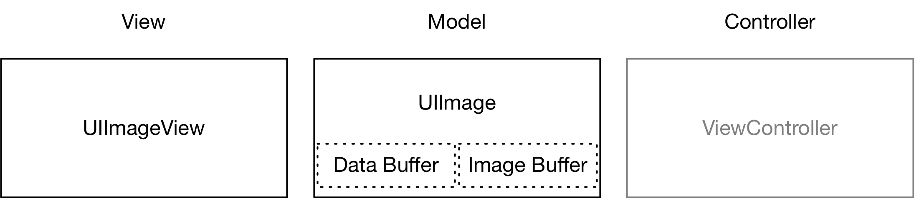

## 前言

## UIImage和UIImageView

UIImage 和 UIImageView 的角色类似于 MVC 架构模式中的数据和视图，如下图所示。



UIImage 是 iOS 中处理图像的高级类。创建一个 UIImage 实例只会加载 Data Buffer，将图像显示到屏幕上才会触发解码，也就是 Data Buffer 解码为 Image Buffer。Image Buffer 也关联在 UIImage 上。

> - Data Buffer 是存储在内存中的原始数据，图像可以使用不同的格式保存，如 jpg、png。Data Buffer 的信息不能用来描述图像的像素信息。
>
> - Image Buffer 是图像在内存中的存在方式，其中每个元素描述了一个像素点。Image Buffer 的大小和图像的大小成正比。

参考资料：

- [《iOS 图像解码和最佳实践》](https://blog.jamchenjun.com/2018/08/22/image-and-graphics-best-practices.html)

## UIImage解码

在iOS中，UIImage解码分为2种：

- 隐式解码

    将图像显示到屏幕上会触发隐式解码。（必须同时满足图像被设置到 UIImageView 中、UIImageView 添加到视图，才会触发图像解码。)
    
    ``` objc
    UIImageView *imageView = [[UIImageView alloc] init];
    [self.view addSubview:imageView];
    [imageView setImage:image];
    ```

- 手动解码

    使用iOS提供的图形框架（UIKit、Core Graphics、Image I/O等）提供的API进行手动解码

参考资料：

- [《iOS的5种图片缩略技术以及性能探讨》](https://www.jianshu.com/p/de7b6aede888)
## UIImage优化实践

1. 减少内存占用

    当实际显示的图片尺寸小于图片真实大小时，对图片进行向下采样，生成缩略图供UI层使用。

2. 优化 CPU 使用

    建立后台线程，在CPU空闲阶段（监听Runloop状态，进入休眠状态时，主线程变空闲）对图片进行提前解码。


## UIView的渲染

基于Core Animation的视图渲染流水线


1. Commit Transaction

    - Layout（布局）：Set up the views
    
        执行细节：调用`layoutSubviews`（若重写了）；创建View和执行`addSubview:`；填充内容和数据查找；一般会造成CPU和 I/O瓶颈
        
        可优化手段：简化view的布局和层级；减少使用xib、storyboard等
    
    - Display（显示）：Draw the views
    
        执行细节： 调用 `drawRect:`（若重写了）；绘制字符串；一般会造成CPU和 内存瓶颈
        
        可优化手段：减少自定义绘制（`drawRect:`），或者在自定义绘制中减少字符串、圆角layer等图层绘制
    
    - Prepare（准备）：Additional Core Animation work
    
        执行细节：图片解码；图片格式转换（转换GPU不支持的图片）；一般会造成CPU和 内存瓶颈
        
        可优化手段：异步线程解码图片；对大图进行向下采样显示；使用GPU支持的图片
    
    - Commit（提交）：Package up layers and send them to render server
    
        执行细节：递归处理Layer-Tree：打包Layer信息并通过IPC发送到Render Server进程；如果图层树太复杂会消耗很大，对性能有很大的影响
        
        可优化手段：简化图层树（如果图层树太复杂会消耗很大，对性能有很大的影响）

2. Decode
3. DrawCalls
4. Render
5. Display

## Core Animation 性能优化

- [《Core Animation 性能优化》](http://zxfcumtcs.github.io/2015/03/21/CoreAnimation/)

## Core Animation执行动画时涉及的图层树类型有几种


- model layer tree (or simply “layer tree”) 
  
    模型层树的对象（`modelLayer`）用于存放动画的目标值（比如起始值和结束值）。

- presentation tree
  
    表示层树的对象（`presentationLayer`）用于给上层访问动画过程中的实时值。

- render tree

    渲染树的对象（`renderLayer`）用于存放动画的绘制数据，供图形系统绘制动画使用，对上层屏蔽。

    render tree 在系统的Render Server进程中，是真正处理动画的地方。而且线程的优先级也比我们主线程优先级高。所以有时候即使我们的App主线程busy，依然不会影响到手机屏幕的绘制工作

> - `model layer tree`其实就是我们口中常说的图层树（`layer tree`）
> - 通过`layer.modelLayer`可以获得一个layer对象的`model layer object`；而事实上`layer.modelLayer`就是Layer对象本身，即`layer == layer.modelLayer`
> - 通过`layer.presentationLayer`可以获得一个layer对象的`presentation layer object`的副本

## iOS 渲染框架

- UIKit Framework

    - 正如Apple官方文档对UIKit Framework的介绍，它主要提供了：界面呈现能力、事件响应能力、驱动RunLoop运行和与系统内核通信的数据。简单来说就是：主要负责界面展示、事件响应以及是RunLoop的需求方。UIView当然是属于UIKit Framework。

- QuartzCore Framework(CoreAnimation)

    - 正如Apple官方文档对Quarz Core Framework的介绍，它提供了图形处理和视频图像处理的能力。简单来说就是：QuartzCore Framework负责把图形图像最终显示到屏幕上，这里我觉得应该是特指CoreAnimation。不要从字面上去理解CoreAnimation的职责，因为它的核心工作不单是负责动画的创建和执行，它还负责把我们用代码构建的界面显示到屏幕上，实际上是CoreAnimation通过OpenGLES做的。（别急，虽然这里面的机理很复杂，但是在后面会提到）。CALayer是属于QuarzCore Framework下的CoreAnimation

- CoreGraphics Framework

    - 如Apple官方文档对Core Graphics Framework的介绍。CoreGraphics Framework一个基于C库函数的高级绘画引擎，它提供了非常强大的轻量级2D渲染能力。可以使用CoreGraphics处理基于path的绘图工作(如，CGPath)、变形操作(如，CGAffineTransform)、颜色管理(如，CGColor)、离屏渲染(如，CGBitmapContextCreateImage)、渲染模式(patterns)、渐变(gradients)、阴影效果、图形数据管理、图形创建、蒙版以及PDF文档的创建、显示和解析。 千万别和QuartzCore混淆，CoreGraphics负责创建显示到屏幕上的数据模型，QuartzCore(CoreAnimation –> OpenGLES)负责把CoreGraphics创建的数据模型真正显示到屏幕上。 CG打头的类都是属于CoreGraphics Framework
    - 当开发者需要在 运行时创建图像 时，可以使用 Core Graphics 去绘制。与之相对的是 运行前创建图像，例如用 Photoshop 提前做好图片素材直接导入应用。相比之下，我们更需要 Core Graphics 去在运行时实时计算、绘制一系列图像帧来实现动画。
    
- Core Image

    - Core Image 与 Core Graphics 恰恰相反，Core Graphics 用于在 运行时创建图像，而 Core Image 是用来处理 运行前创建的图像 的。Core Image 框架拥有一系列现成的图像过滤器，能对已存在的图像进行高效的处理。
    - 大部分情况下，Core Image 会在 GPU 中完成工作，但如果 GPU 忙，会使用 CPU 进行处理。

- OpenGL ES

    - OpenGL ES（OpenGL for Embedded Systems，简称 GLES），是 OpenGL 的子集。在前面的 图形渲染原理综述 一文中提到过 OpenGL 是一套第三方标准，函数的内部实现由对应的 GPU 厂商开发实现。
    
- Metal

    - Metal 类似于 OpenGL ES，也是一套第三方标准，具体实现由苹果实现。大多数开发者都没有直接使用过 Metal，但其实所有开发者都在间接地使用 Metal。Core Animation、Core Image、SceneKit、SpriteKit 等等渲染框架都是构建于 Metal 之上的。
    - 当在真机上调试 OpenGL 程序时，控制台会打印出启用 Metal 的日志。根据这一点可以猜测，Apple 已经实现了一套机制将 OpenGL 命令无缝桥接到 Metal 上，由 Metal 担任真正于硬件交互的工作。
    
## UIKit Framework、QuartzCore Framework(CoreAnimation)、CoreGraphics Framework 三者的关系


UIKit 建立在 Core Animation 基础之上，在 Core Animation 之下是 OpenGL ES 和 Core Graphics，分别对应 GPU 和 CPU。Core Animation 本身并不做渲染工作，而是将这些工作转交给 Graphics Hardware(GPU)处理。


