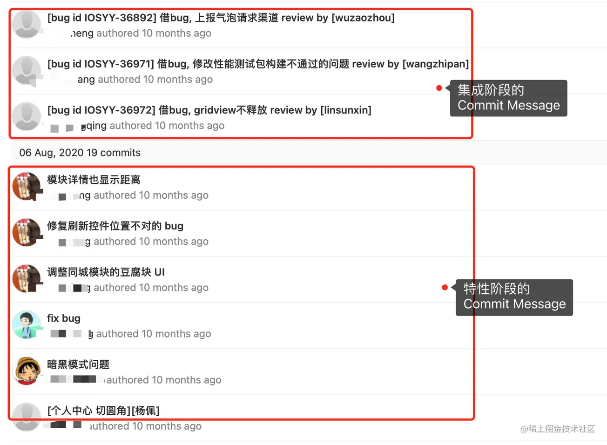
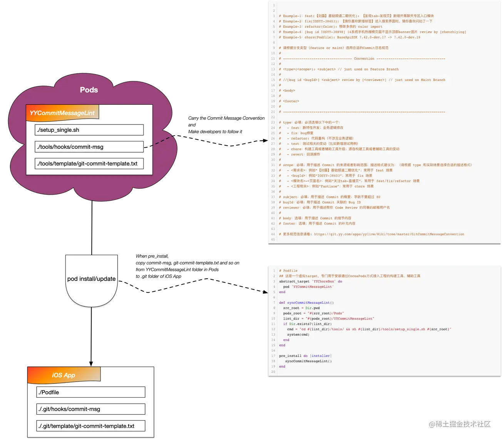

## 前言

我于2020年年中加入了手机YY iOS团队，那时发现团队成员在特性阶段所写的`Commit Message`比较随意；在集成阶段，则比较统一：



> 这里简要介绍一下手Y团队采用的`Git`分支管理模型和`YY GitLab Server`端对`maint`分支实施的`Commit Message`规范。
>
> 手Y团队采用的`Git`分支管理模型是一种基于主干的分支模型：`master-maint-feature`，其中：
> 
> - `master`分支是主干分支，用于存放对外发布的版本，永久存在，属于长生命周期
> - `maint`分支是集成分支，从`master`分支拉出，用于集成特性和发布版本，存在于集成阶段（在此阶段，团队成员都往该分支提交和只提交修复代码），属于中生命周期（版本发布后，合并回`master`分支，这之后一般还会存在一段时间）
> - `feature`分支是特性分支，从`master`分支拉出，用于开发特性，存在于特性阶段（在此阶段，团队成员都往该分支提交特性代码、修复代码等），属于短生命周期（特性集成之日，合并回`master`分支，然后被删除）
> 
> `YY GitLab Server`端对`maint`分支实施的`Commit Message`规范是，要求提交格式如下：
> ```
> [bug id <bugId>] <subject> review by [<reviewer>]
> ```
>

为了使得手Y工程的`Commit Message`规范变得完整（任意阶段都有规范）和完善，从而帮助团队更好地发展和更好地维护工程，我根据团队实际情况和需求，制定和落地了一套合适手Y的新的`Commit Message`规范。截止到目前，该规范已经运行快一年，给团队和工程带来了显著的收益：

- 帮助团队成员建立更好的规范意识
- 帮助团队新成员更好地理解`Commit`和`历史代码`
- 帮助团队成员更快地对当前`Commit`进行`Code Review`
- 让工程变得更好维护
- 其他等等

新`Commit Message`规范在经过实践的验收后，作为一个负责的开发团队，我们觉得可以对外分享我们的这个新的`Commit Message`规范，以及分享我们如何去保障新`Commit Message`规范的实施。

<!-- more -->

## 新 Commit Message 规范
依据手Y的工作流和既存的`Commit Message`规范，新的`Commit Message`规范按照集成时间点前后分为2个版本：

- `Feature Commit Message`规范：应用于`feature`分支（比如`yymobile_7.41_composite_feature`分支），功能特性研发阶段
- `Maint  Commit Message`规范：应用于`maint`分支（比如`yymobile_7.41_maint`分支），功能特性集成阶段

下面将会对这2个版本`Commit Message`规范进行详细的介绍。

### Feature Commit Message 规范

在功能特性研发阶段，`Commit Message`由三部分组成：

1. `header`：必填；由`type`、`scope`、`subject`组成；用于描述`Commit`的简介内容（类型、来源或影响范围、概要）
2. `body`：选填；用于描述`Commit`的细节内容
3. `footer`：选填；用于描述`Commit`的补充内容

具体格式如下：

```shell
<type>(<scope>): <subject>

<body>

<footer>

```

> **备注**：header 中涉及到的括号`()`和冒号`:`均使用英文标点符号。

下面将会对`Commit Message`中每个组成部分进行详细介绍。

#### type（必填）

`type`用于描述`Commit`的类型，目前可选类型有以下几种：

- `feat`：新特性开发；业务逻辑修改
- `fix`：bug修复
- `refactor`: 代码重构（不涉及业务逻辑）
- `test`：测试相关的变动（比如新增测试用例）
- `chore`：构建工具或者辅助工具升级；源自构建工具或者辅助工具的变动
- `revert`：回滚操作

开发者需要根据实际场景选择合适的`type`。

> **备注**：每个类型的`Commit Message`示例请看下面的《Feature Commit Message 规范示例》

#### scope（必填）

`scope`用于描述`Commit`的来源或者影响范围。`scope`的描述格式建议为：

- `<需求名>`：例如`【刘露】基础频道二期优化`；常用于`feat`场景
- `<bugId>`：例如`IOSYY-38403`；常用于`fix`场景 
- `<模块名>-<页面名>`：例如`关注tab-直播页`；常用于`feat/fix/refactor`场景
- `<工程相关>`：例如`Fastlane`；常用于`chore`场景

> **提示**：请根据`type`和实际场景选择合适的描述格式

#### subject（必填）

`subject`用于描述`Commit`的概要，具体要求如下：

- 简要准确地描述本次提交的变动，**字符数量不要超过 80**
- `type`和`subject`之间以英文冒号`:`分隔
- 不以标点结尾

#### body（选填）

`subject`用于描述`Commit`的细节内容，具体要求如下：

- 详细有条理地描述本次提交的变动，例如具体的逻辑变更、直接影响的范围、潜在的影响范围等
- 可写多行，每行不超过72个中文字符，整体建议不要超过200个中文字符

#### footer（选填）

`footer`用于描述`Commit`的补充内容，例如关掉的`Issue`关联的`Isuue URL`、`Report ID`、`Crash ID`等信息，修复的`bug`关联的`Bug ID`、`Bug URL`、`备注 URL`等信息。


### Feature Commit Message 规范示例

#### feat 类日志示例

1. 示例一

    ``` shell
    feat(【刘露】基础频道二期优化): 【发现tab-发现页】新增开黑聊天专区入口模块
     
    PM：刘露
    
    ```
    
1. 示例二

    ``` shell
    feat(【刘露】基础频道二期优化): 【发现tab-发现页】修改显示开黑聊天专区入口的逻辑
    
    命中实验：yy_ios_741_jcpdyh 或者命中实验：yy_ios_741_jcpdyh_entrance 的时候都显示入口
    
    ```

1. 示例三

    ``` shell
    feat(内存监控): MemoryDetector-YY SDK 由 v0.3.6 升级至 v0.3.7
    
    ```
#### fix 类日志示例

1. 示例一

    ``` shell
    fix(IOSYY-38403): 【猜你喜欢新增标签】进入搜索界面时，猜你喜欢闪动了一下
    
    问题原因：子模块请求数据队列异步请求数据过程中，YYNewSearchDisplayViewController-viewWillAppear处让【热词】子模块请求数据并刷新TableView，导致部分提前收到数据的子模块（比如【猜你喜欢】子模块）提前渲染出UI来
    解决方案：子模块请求数据队列异步请求数据完毕后，YYNewSearchDisplayViewController-viewWillAppear处才允许让【热词】子模块请求数据
    影响范围：【搜索预览页】
    潜在影响范围：无
    
    ```
    
1. 示例二

    ``` shell
    fix(IOSYY-38411): #41712 问题复现 页面滑动时标签改变，不显示省略号
    
    问题原因：[label sizeToFit]在一些iOS版本上会破坏label实例的constraints（约束），导致显示异常
    解决方案：不要使用sizeToFit；另外，sizeToFit适用于没有使用约束的场景下，其和约束属于两种布局方案，前者是Frame布局，后者是约束布局
    影响范围：【关注tab-直播页-猜你喜欢新增标签】【搜索预览页-猜你喜欢模块-猜你喜欢新增标签】
    潜在影响范围：无
    
    更多Bug详情见 IOSYY-38411 下的备注：http://project.sysop.duowan.com/browse/IOSYY-38411?focusedCommentId=710520
    
    ```

1. 示例三

    ``` shell
    fix(YYMobileTarget): 修复工程的Signing配置
    
    发现工程的Signing配置被改为了Auto方式，现在修改为Manual方式
    
    ```

#### refactor 类日志示例

1. 示例一

    ``` shell
    refactor(配置中心-直播间): 删除无用配置
     
    ```

1. 示例二

    ``` shell
    refactor(礼物-付费礼物广播): 抽出礼物广播通用 GiftBroadcastModel
     
    ```
    
#### test 类日志示例

1. 示例一

    ``` shell
    test(UseCases): 新增使用错误密码登录的测试用例
    
    ```

#### chore 类日志示例

1. 示例一

    ``` shell
    chore(CocoaPods): cocoapods-binary 由 v0.4.3 升级至 v0.4.4 
     
    ```

1. 示例二

    ``` shell
    chore(Fastlane): 优化构建脚本 
     
    ```
#### revert 类日志示例

1. 示例一

    ``` shell
    revert(YYProject): 回滚主工程移除 YYWidgetExtension Target 的操作
     
    Revert "fix(YYProject): 暂时从主工程移除 YYWidgetExtension Target，以等待企业证书部署完毕，避免期间 CI 构建失败" 
     
    This reverts commit 22fd6f31.
     
    ```


### Maint Commit Message 规范

在功能特性集成阶段，`Commit Message`兼容既定规范（部署在`YY GitLab Server`端对`maint`分支实施的`Commit Message`规范），其由三部分组成：

1. `header`：必填；由`bugId`、`subject`、`reviewer`组成；用于描述`Commit`的简介内容（类型、影响范围、概要）
2. `body`：选填；用于描述`Commit`的细节内容
3. `footer`：选填；用于描述`Commit`的补充内容

> 手Y团队规定，集成测试期间，原则上只修复Bug，禁止提交优化、重构功能。
> 

具体格式如下：

```
[bug id <bugId>] <subject> review by [<reviewer>]

<body>

<footer>

```

其中：

- `bugId`：必填；用于描述`Commit`关联的 Bug ID
- `subject`：必填；用于描述 Bug 的原因概要；**字符数量不要超过 80**
- `reviewer`：必填；用于描述帮你 Code Review 的同事的邮箱用户名
- `body`：选填；定义和要求与《Feature Commit Message 规范》中的保持一致
- `footer`：选填；定义和要求与《Feature Commit Message 规范》中的保持一致


### Maint Commit Message 规范示例

1. 示例一

  ``` shell
[bug id IOSYY-38898] 14系统手机热搜榜页面不显示顶部banner图片 review by [chenzhiying]

  ```

2. 示例二

  ``` shell
[bug id IOSYY-32551] 【崩溃系统提单_首报7.24.0-develop】 review by [chenjianfeng3] 
  
This reverts commit e4fe6fb1.
  
  ```

## 新 Commit Message 规范实施和保障

新的`Commit Message`规范制定后，为了检验和保障实施的的效果，我们决定先在手Y工程上实施：通过以点带面，逐步帮助手Y团队成员建立`Commit Message`规范规范意识。

为了保障实施的的效果，我同步研发了配套工具`YYCommitMessageLint`。为了保障实施落地时阻力达到最小，`YYCommitMessageLint`建立了一个目标：不对除手Y工程之外的项目造成约束影响，以及最大限度地方便手Y团队成员方便安装该工具。

为了达到上述目标，`YYCommitMessageLint`设计成了一个`Pod`库，通过`CocoaPods`接入到手Y工程项目中。下图是`YYCommitMessageLint`接入iOS项目的流程图：




`YYCommitMessageLint`接入iOS项目的具体步骤如下：

1. 编辑`Podfile`，添加`YYCommitMessageLint`的依赖声明代码
     ```ruby
     ## 这是一个虚拟target，专门用于安装通过CocoaPods方式接入工程的构建工具、辅助工具
    abstract_target 'YYChoreBox' do
      pod 'YYCommitMessageLint'
    end
    ```

2. 编辑`Podfile`，添加同步`YYCommitMessageLint`的函数定义
     ```ruby
    def syncCommitMessageLint()
      src_root = Dir.pwd
      pods_root = "#{src_root}/Pods"
      lint_dir = "#{pods_root}/YYCommitMessageLint"
      if Dir.exists?(lint_dir)
        cmd = "cd #{lint_dir}/tools/ && sh #{lint_dir}/tools/setup_single.sh #{src_root}"
        system(cmd)
      end
    end
    ```

3. 编辑`Podfile`，在`Pod`的`pre_install`回调函数中执行`syncCommitMessageLint`
     ```ruby
     pre_install do |installer|
        syncCommitMessageLint()
     end
     ```

 ### `YYCommitMessageLint`的局限性
 `YYCommitMessageLint`适合应用于单个工程场景——这是它的优点也是它的缺点。因此，若你期望它的作用范围由“点”扩展到“面”时，就需要另外的改造方案了——今年开春以来，手Y开始着手业务组件化，我们希望那些业务组件工程也被纳入新`Commit Message`规范的约束范围内（事实上除了`Commit Message`规范，还新增了其他规范），为此，我开始设计实现了新的方案——这个方案将会在下一期进行分享，敬请期待。
