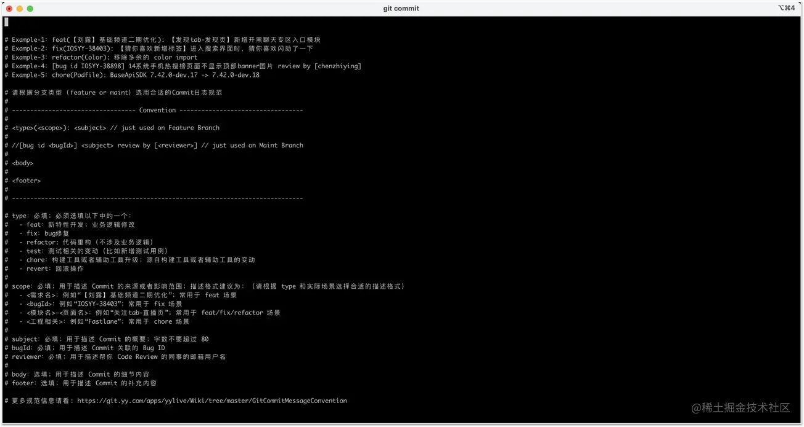
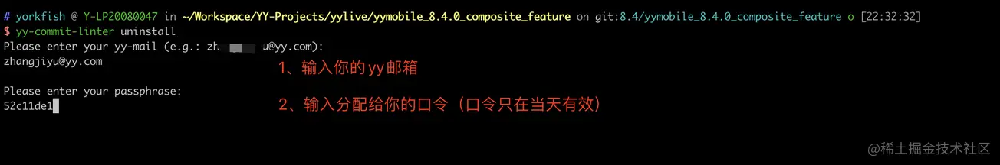

## 前言
这篇文章既是对上篇[《手Y开发规范化建设一：Commit Message 规范建设》](../手Y开发规范化建设一：Commit%20Message%20规范建设/readme.md)在文章结尾抛出的问题的解答，也是对外分享已经在手Y业务团队落地实施5个月（自2021年8月初开始）了的《手Y业务工程规范》的建设经验。

## 业务背景
截止到目前，手Y业务组件数量已经达到30+。伴随着业务的进一步复杂化，团队中出现了不少有碍代码质量、影响效率的问题，比如：

- 部分手Y业务组件随便引入体积超标图片资源，引起手Y和联运SDK体积劣化
- 部分已做二进制化的手Y业务组件不正确设置代码文件的`Target Membership`，导致构建的二进制产物丢失头文件或者符号，阻塞了手Y的正常开发和构建
- 部分手Y业务组件不规范使用`API`，导致手Y运行时异常
- 手Y业务组件提交的 commit 日志格式各异

为进一步提升手Y的代码质量，提高团队的协作开发效率，我制定了《手Y业务工程规范》来引导团队成员规范开发。

<!-- more -->

## 手Y业务工程规范简介

《手Y业务工程规范》是由一系列的满足业务和团队特定需要的规则组成。截止到目前，《手Y业务工程规范》包含了以下规则：

-   no_fat_resource_files
-   no_unreferenced_code_files
-   no_conflicting_files
-   yy_commit_msg_convention
-   yy_assert_api_first
-   yy_color_api_first
-   yy_http_api_first
-   yy_userdefaults_api_first
-   yy_dispatch_task_block_api_first

> 后面随着团队和业务的需要，规则会有增删改。

下面将会对以上规则进行一一介绍，分享这些规则的承载目的和内容。

### no_fat_resource_files

- 规则目的：限制工程随意引入体积超标的资源文件，防止手Y和联运SDK体积劣化
- 规则简介：工程引入的图片的体积不能超过4kb（直播间业务工程引入的图片体积不能超过2.5kb）

> 该规则规定了工程引入的图片体积不能超过4kb，而由于百度App对联运SDK体积有更严苛的要求，该规则要求直播间业务工程引入的图片体积不能超过2.5kb。随着业务的变化，未来这2个数字有可能是会变化的。

### no_unreferenced_code_files

- 规则目的：防止残留无用代码文件，以及预防业务组件工程的二进制产物缺失头文件或者符号，阻塞手Y的正常开发和构建
- 规则简介：工程目录中的代码文件（包括有：头文件、实现文件、库文件、xib文件、storyboard文件）需要保证设置了有效的`Target Membership`

> 在手Y业务团队中，导致【业务组件工程的二进制产物缺失头文件或者符号】问题产生的原因是：
> 每个业务组件工程在实施二进制化后，都有单独的二进制产物构建工程；而大多数同学在做业务组件开发时，都是使用`Development Pods`方式接入到手Y宿主工程进行开发，在开发过程中新增的代码文件都没有同步回二进制产物构建工程，从而导致了业务组件二进制产物缺失头文件或者符号的问题。
> 
> 那么对这个问题的解决，除了是选择在提交代码时，做`no_unreferenced_code_files`规则的检测，还有其他代替方案吗？
>
> 答案是：有的。这个代替方案就是做【去工程化】。所谓的【去工程化】，就是基于项目的文件夹结构，使用工程自述文件（`project spec file`）生成 Xcode 工程文件：
>
> 
>
> > 目前业内提供实现【去工程化】的工具有：
> > - [XcodeGen](https://github.com/yonaskolb/XcodeGen)
> > - [struct](https://github.com/lyptt/struct)
>
> 基于这个方案，我们可以选择在构建二进制产物时，根据工程自述文件生成等价于开发时用到的 `Development Pods`工程，从而解决掉上述问题。目前手Y已经在部分业务组件上实施该方案。
>

### no_conflicting_files
- 规则目的：防止没解决`merge conflicts`（合并冲突）的文件阻塞他人的开发
- 规则简介：开发者不能提交存在`merge conflicts`（合并冲突）的文件到工程仓库中

### yy_commit_msg_convention
- 规则目的：统一手Y和手Y业务组件的 Commit 日志规范
- 规则简介：开发者提交的 Commit 日志需要满足[《YY Commit 日志规范》](https://juejin.cn/post/6980910026151952391#heading-1)
  
    

### yy_assert_api_first
- 规则目的：规范API使用，优先使用业务定制的`YY API`代替`System API`；以及让业务组件的二进制包在宿主的`debug`环境下可运行`Assert`代码
- 规则简介：工程若依赖了`YYAppEnvironment`，则该工程的代码应优先使用`YYAppAssert API`而不是 `NSAssert API`，比如：

    ``` objc
    // bad case
    NSAssert(NO, @"unimplemented enum value");
    
    // good case
    #import <YYAppEnvironment/YYAppEnvironment.h>
    YYAppAssert(NO, @"unimplemented enum value");
    ```
> 关于规则目的提及的第2点：让业务组件的二进制包在宿主的`debug`环境下可运行`Assert`代码，这里补充一下知识点。目前业务组件的二进制包都是`release`编译，`release`编译时，业务组件中`NSAssert`代码会被编译器清理掉，这会导致业务组件的二进制包在宿主的`debug`环境下运行会失效，达不到开发者调试的目的。
>
> 为此我们的一个解决方案是： 业务组件使用`YYAppAssert API`代替`NSAssert API`，然后宿主接入`YYAppAssert`源码编译，然后业务组件的`Assert`代码可以和以前一样，宿主运行环境是`debug`环境时，`Assert`代码生效；宿主环境是`release`环境时，`Assert`代码不生效。

### yy_color_api_first
- 规则目的：规范API使用，优先使用业务定制的`YY API`代替`System API`；以及反向推动设计同事优先使用视觉规范上的色表颜色
- 规则简介：工程若依赖了`yybaseapisdk`，则该工程的代码应优先使用`YYColor API`而不是`UIColor API`，比如：

    ``` objc
    // bad case
    UIColor *bgColor = [UIColor whiteColor];
    
    // good case
    #import <yybaseapisdk/YYColor.h>
    UIColor *bgColor = [YYColor B0Color];
    ```
    
### yy_http_api_first
- 规则目的：规范API使用，优先使用业务定制的`YY API`代替`System API`
- 规则简介：工程若依赖了`yybaseapisdk`，则该工程的代码应优先使用`YYNetClient API`而不是 `NSURLSession/NSURLConnection API`，比如：

    ``` objc
    // bad case
    NSURLSession *session = [NSURLSession sessionWithConfiguration:[NSURLSessionConfiguration defaultSessionConfiguration]];
    NSURL *imgUrl = [NSURL URLWithString:urlStr];
    NSURLSessionDataTask *task = [session dataTaskWithURL:imgUrl completionHandler:^(NSData * _Nullable data, NSURLResponse * _Nullable response, NSError * _Nullable error) {
      // ...
    }];
    [task resume];
    
    // good case
    #import <yybaseapisdk/YYNetClient.h>
    YYJumpLiveWinRecmdInfoRequest *request = [YYJumpLiveWinRecmdInfoRequest new];
    [YYNetClient sendUrl:urlStr
                  method:YYHttpRequestMethodGET
                 request:request
           responseClass:YYJumpLiveWinRecmdInfoResponse.class
              onFinished:responseBlock];
    ```
    
### yy_userdefaults_api_first
- 规则目的：规范API使用，优先使用业务定制的`YY API`代替`System API`
- 规则简介：工程若依赖了`yybaseapisdk`，则该工程的代码应优先使用`YYUserDefaults API`而不是 `NSUserDefaults API`，比如：

    ``` objc
    // bad case
    id hiddenObj = [[NSUserDefaults standardUserDefaults] objectForKey:key];
    BOOL hidden = (hiddenObj != nil) ? [hiddenObj boolValue] : YES;
    
    // good case
    #import <yybaseapisdk/YYUserDefaults.h>
    #import <yybaseapisdk/YYUserDefaultsDefine.h>
    BOOL hidden = [YYUserDefaults yy_boolForKey:key forModule:module];
    ```
### yy_dispatch_task_block_api_first
- 规则目的：规范API使用，优先使用业务定制的`YY API`代替`System API`
- 规则简介：工程若依赖了`yybaseapisdk`，则该工程的代码应优先使用`YY Dispatch Task Block API`（`dispatch_yy_sync`/`dispatch_yy_async`/`dispatch_sys_sync`/`dispatch_sys_async`） 而不是`System Dispatch Task Block API`（`dispatch_sync`/`dispatch_async`），比如：

    ``` objc
    // bad case
    dispatch_async(dispatch_get_main_queue(), ^{
      // ...
    });
    
    // good case
    #import <yybaseapisdk/YYDispatchQueue.h>
    dispatch_yy_async(dispatch_get_yy_main_queue(), ^{
      // ...
    });
    ```

## 保障《手Y业务工程规范》实施的技术方案

为保证《手Y业务工程规范》的实施，我们研发了配套的保障工具：`yy-commit-linter`：

1. `yy-commit-linter`是一个基于`Ruby`开发的`gem`包
1. 为了实现`yy-commit-linter`的自动安装和升级，我们把`yy-commit-linter`包装成一个`Pod`库
1. 然后在手Y主工程安装`Pod`库时，安装`yy-commit-linter CLI`到开发者的电脑，并设置`git global hooks`指向`yy-commit-linter git-hooks`
1. `yy-commit-linter git-hooks` 承载了《手Y业务工程规范》的每项检测，当开发者在手Y业务工程完成开发提交代码时，`yy-commit-linter git-hooks` 就会被触发，然后会对提交的内容进行检测，确保开发者遵守了制定的规范


## 手Y业务工程规范FAQ

### 对于暂不需要做二进制化的业务组件工程，如何临时跳过`no_unreferenced_code_files`规则的检测？

针对这种场景，`yy-commit-linter`为`no_unreferenced_code_files`规则设计和实现了名为【白名单凭证（`white_passport`）】的白名单机制：若业务组件工程存在白名单凭证文件，即可不受`no_unreferenced_code_files`规则的约束。

添加白名单凭证文件步骤如下：

```shell
# 进入业务工程根目录
cd path/to/yyxxxcomponent-ios

# 为当前业务工程添加白名单凭证（white_passport）
yy-commit-linter white_passport
```

### 图片资源体积超标但是又必须放置在本地时，这时候该如何跳过`no_fat_resource_files`规则的检测？

针对这种场景，`yy-commit-linter`为`no_fat_resource_files`规则设计和实现了名为【白名单口令（`white_passphrase`）】的白名单机制：若违规的图片资源存在合法的白名单口令，则可不受`no_fat_resource_files`规则的约束。

为违规的图片资源添加合法的白名单口令的示例流程如下：

1. 向违规的图片资源向`yy-commit-linter`的持有人申请获得专属白名单口令
2. 在工程根目录下为违规的图片资源添加专属白名单口令，示例如下：
    ```shell
    # 进入业务工程根目录
    cd path/to/yyxxxcomponent-ios
    
    # 为违规的图片资源文件添加分配给它的白名单口令（white_passphrase） xxx1（若你有多个，则执行多次该指令）
    yy-commit-linter white_passphrase --passphrase xxx1
    
    # 为下一个违规的图片资源文件添加分配给它的白名单口令（white_passphrase）xxx2
    yy-commit-linter white_passphrase --passphrase xxx2
    ```

### 一些特殊场景下，必须使用`System API`，这时候该如何跳过`yy_api_first`系列规则的检测？

针对这种场景，`yy-commit-linter`为`yy_api_first`系列规则设计和实现了名为【白名单标签（`white_label`】的白名单机制：若违规的代码存在一个白名单标签，则可不受对应的`yy_api_first`规则的约束。

【白名单标签（`white_label`】形式上是一个 `ignore_yy_api_first`注释标签。

添加白名单标签示例如下：

``` objc
// 示例1
NSUserDefaults *userDefaults = [[NSUserDefaults alloc] initWithSuiteName:groundIdentifier]; //ignore_yy_api_first

// 示例2
NSUserDefaults *userDefaults = [[NSUserDefaults alloc] initWithSuiteName:groundIdentifier]; /* ignore_yy_api_first */
```

### 如果需要临时停用`yy-commit-linter`检测功能，应该如何处理?

针对这种场景，`yy-commit-linter`为提供了`uninstall`功能，但是为了防止用户滥用，设计了`uninstall`口令：执行`uninstall`前，需要先向`yy-commit-linter`的持有人申请一个口令，然后执行`uninstall`时，输入该口令才能成功`uninstall`。

执行`uninstall`的示例如下：




> 需要注意的是，`uninstall`口令具有定向性（只对申请人生效）和时效性（只在当天有效）。

