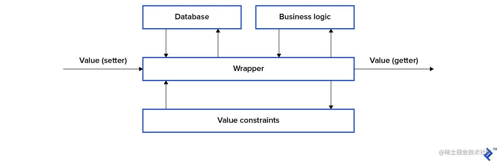
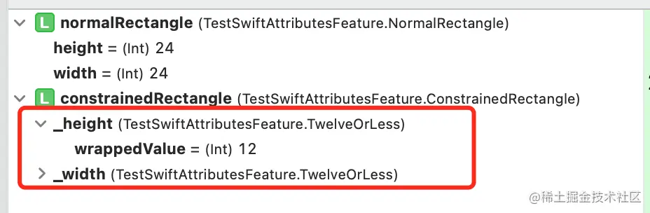

`@propertyWrapper`是`Swift5.1`新增的语法糖特性，其目的是提升代码复用性——要探究代码复用性提升的缘由，则我们需要把视角聚焦到业务场景中——在业务场景中，开发者对`property`的操作，除了读写，还常常会为其添加额外的操作代码，比如：

- 对`property`的值添加约束性代码，比如检测赋值是否在某个区间
- 对`property`的读写访问添加数据库操作代码（从数据库中读取值，并在值改变时重写入到数据库）
- 对`property`的读写访问添加其他业务逻辑代码，比如打印日志

当你需要在多个`property`都添加相同的操作代码的时候，这时候你就可以通过`@propertyWrapper`这个语法糖工具来解决。`@propertyWrapper`能够帮助你把`property`的读写访问代码以及额外的操作代码封装为一个自定义的`Property Wrapper`（属性包装器），然后让你通过注解的方式把定义的`Property Wrapper`（属性包装器）应用到各个`property`上——然后在编译时，编译器会根据`Property Wrapper`（属性包装器）的描述对被装饰了`property`的代码进行自动转换或者合成，从而实现`property`操作代码的复用目标。



那么如何实现一个`Property Wrapper`（属性包装器），并把它应用到一个`property`上呢？建议直接查阅官方教程[《Property Wrappers》](https://docs.swift.org/swift-book/LanguageGuide/Properties.html#ID617)。下面会通过一个简单示例进行演示，并藉此进行更深一层的思考分享。

```swift
@propertyWrapper
struct TwelveOrLess {
    var wrappedValue: Int {
        didSet {
            wrappedValue = min(wrappedValue, 12)
        }
    }

    init(wrappedValue: Int) {
        self.wrappedValue = min(wrappedValue, 12)
    }
}

struct NormalRectangle {
    var height: Int
    var width: Int
}

struct ConstrainedRectangle {
    @TwelveOrLess var height: Int
    @TwelveOrLess var width: Int
}

func test_TwelveOrLess() {
    let normalRectangle = NormalRectangle(height: 24, width: 24)
    print("\(type(of: normalRectangle.height))") // Prints "Int"

    let constrainedRectangle = ConstrainedRectangle(height: 24, width: 24)
    print("\(type(of: constrainedRectangle.height))") // Prints "TwelveOrLess"
}
```

上面示例中，通过`@propertyWrapper`实现了一个自定义的属性包装器`@TwelveOrLess`，并通过注解的方式装饰了`ConstrainedRectangle`的`height`属性和`width`属性，我们在获取其属性的类型时，发现其类型依然是`Int`类型。但是，事实是真的这样吗？请看下面断点：



`ConstrainedRectangle`的`height`属性和`width`属性在运行时在内存中真正的类型是`TwelveOrLess`类型，而不是`Int`类型——这说明，编译器根据自定义的属性包装器自动生成的代码比官方文档和其他博客所描述的要多，而且这部分是过于隐性的——而这正是我想表达和分享的——这些隐性代码在工程中对开发协作的影响：
- 毫无疑问，`@propertyWrapper`和基于其实现的自定义的属性包装器带来的正向影响是：满足了代码复用的目标
- 但是，这个实现是一种隐性实现，可预见的以下的一些负向影响：
    - 接演示的例子，官方获取运行时对象类型的API`type(of:)`返回的结果和实际断点的结果不一致，这会给开发者，特别是新人开发者带来困惑。
    - 进行代码版本管理时，容易丢失这种注解，从而引起业务代码出现bug——特别是在大型团队中进行版本代码合并时，不同开发者其水平不一，业务上下文不一，更容易丢失这种注解。

那么有没更好的解法呢？这是后续要进一步思考和探索的。

