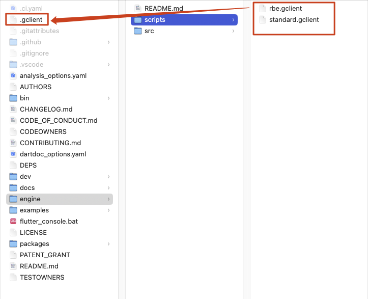
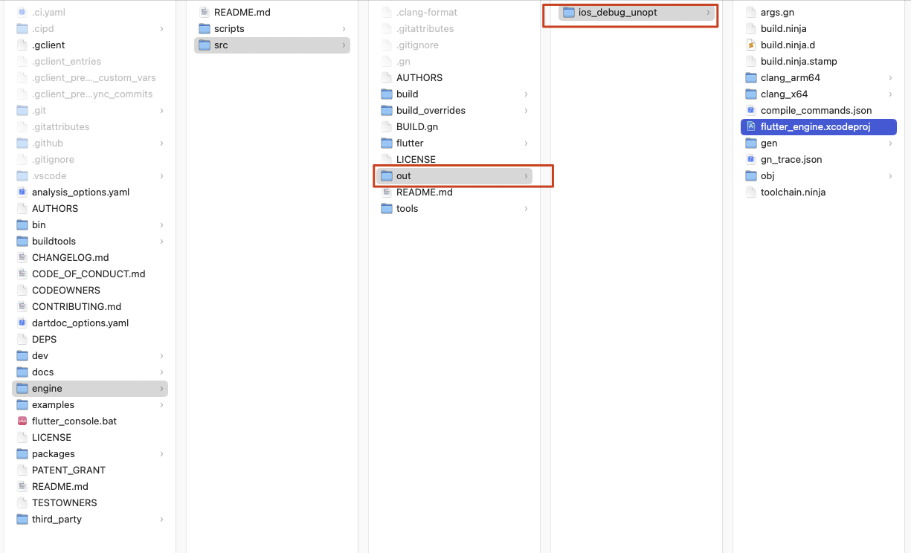
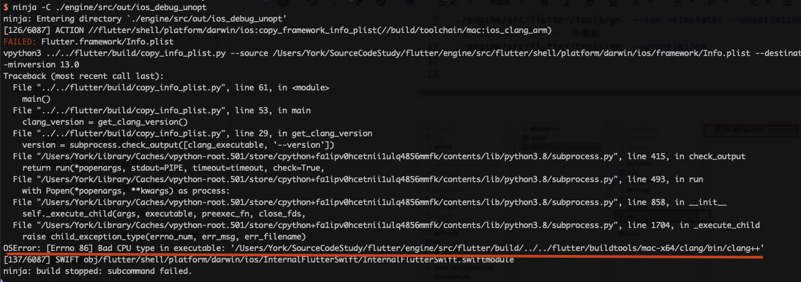
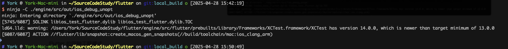

> 我的设备：
>
> - macmini m4
> - macOS 15.3.2

## 1. macOS 端搭建源码编译环境

1. 按照[官方教程](https://chromium.googlesource.com/chromium/tools/depot_tools.git)安装 depot_tools

> [depot_tools](https://chromium.googlesource.com/chromium/tools/depot_tools.git) 是 Chromium 源码依赖管理工具集，内含 gclient 等工具；用于帮助 Chromium、Flutter Engine等项目同步代码和管理编译所需的依赖

2. brew 安装 ant 和 ninja

```bash
brew install ant brew install ninja
```

## 2. 下载 Flutter Engine 源码和安装所需依赖

1. 下载 Flutter Engine 源码

```bash
git clone git@github.com:flutter/flutter.git
```

2. 进入源码根目录，然后复制  engine/scripts 任意一个 `xx.gclient` 文件到 根目录中，并修改名称为 `.gclient`。我用的是`standard.gclient`。



3. 在源码根目录执行`gclient sync`同步代码和安装所需的依赖

<!-- more -->

## 3. 编译 Flutter Engine

1. 生成构建工程：进入源码根目录，然后运行 gn 命令生成指定平台的构建工程，构建工程存放在 `engine/src/out` 目录下

```bash
#构建iOS设备使用的引擎
#真机debug版本
./engine/src/flutter/tools/gn  --ios --unoptimized --no-prebuilt-dart-sdk 

# 其他版本
#真机release版本
./engine/src/flutter/tools/gn  --ios -unoptimized --runtime-mode=release
#模拟器版本
./engine/src/flutter/tools/gn  --ios -simulator --unoptimized
#主机端(Mac)构建  --  热重载
./engine/src/flutter/tools/gn  --unoptimized --no-prebuilt-dart-sdk 

```



2. m系列芯片的 macOS， 需要安装 Rosetta2，保证一些尚未适配m系列芯片的工具链可以经常运行：`softwareupdate --install-rosetta --agree-to-license`

> 在 m4 设备上，没安装 Rosetta2 前遇到的编译问题：`OSError: [Errno 86] Bad CPU type in executable:`

3. 调用 ninjia 编译指定的构建工程，如：`ninja -C ./engine/src/out/ios_debug_unopt`
