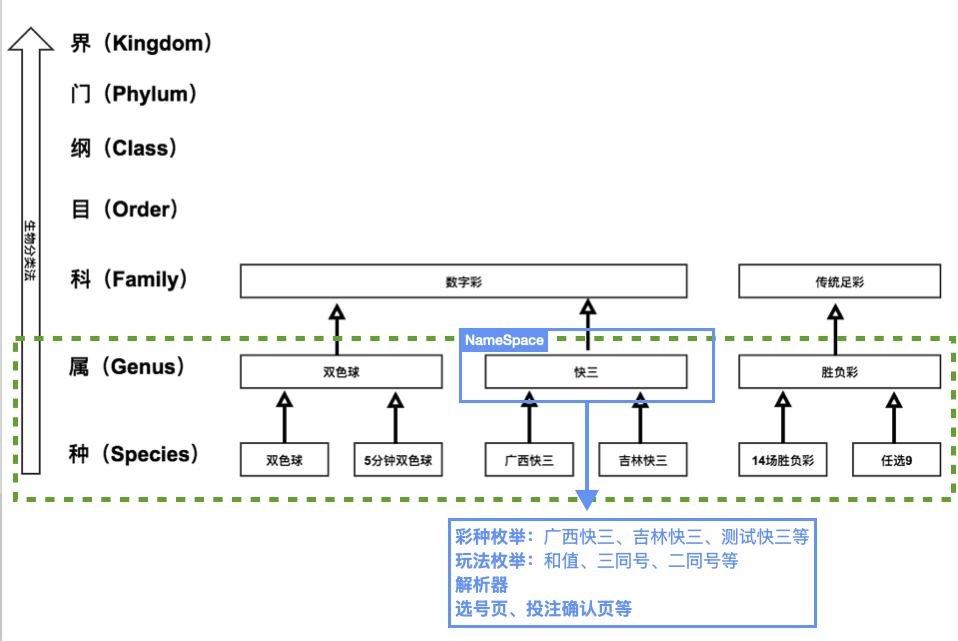

今年在找工作，回顾之前在网易做的赢彩票项目时，发现到现在业内在网上也没有出现像我那样基于 `Swift 关联协议` 去实现的一个高内聚的数据类型系统的 Case，所以在此分享一下我在该项目基于 `Swift 关联协议` 的高内聚的数据类型系统：彩票数据类型系统。

这里先简单介绍一下业务背景吧：该项目需要接入大量的彩票，然后我如下图基于生物分类法对彩票进行了分类，然后以`彩票属`为业务单元构建`命名空间（NameSpace）`，`命名空间（NameSpace）`内部收敛存放该`彩票属`下的`彩票种`的具体类型、玩法类型、以及通用的业务逻辑模块（此处的「通用」是指同一个`彩票属`的`彩票种`的业务逻辑是一样的，如解析逻辑、选号逻辑、计费逻辑等）。



存在多个`彩票属`的情况下，这时候必然需要构建一个协议保证每个具体的`彩票属`类型的内部实现是一致的，比如内部必须有具体的`彩票种`类型，具体的玩法类型等。这时候则是通过 `Swift` 的关联协议实现的。下面是一个简略版的彩票数据类型系统实现代码：

```Swift
//
//  Demo.swift
//  ProgrammableNamespaceDemo
//
//  Created by YorkFish on 2025/6/11.
//

import Foundation

// MARK: LotterySpecies-彩票种
/// 彩票属（Genus）类型
public enum LotteryGenusType: String {
    /// 未知彩票属
    case unknown
    /// 双色球
    case ssq
    /// 快三
    case k3
    /// 胜负彩
    case sfc
    /// 排列五
    case plw
    /// 其他等等
}

/// 彩票种类key协议
public protocol LotterySpeciesKeyProtocol: Hashable, Equatable, RawRepresentable {

    /// 返回当前LotterySpeciesKey类型的所有case
    static var allCases: [Self] { get }
}

/// 彩票种类协议
public protocol LotterySpeciesTypeProtocol: CustomStringConvertible {
    /// 生成 LotterySpeciesDefaultInstance（彩票种默认实例）
    ///
    /// - Important: 实例的 speciesKey 默认取第一个枚举值；实例的 lotteryId 默认取 speciesKey 对应的LotterySpecies（彩票种）配置的 supportedIds 里的最小ID；
    init()

    /// 根据 lotteryId 生成 LotterySpeciesInstance（彩票种实例）
    init?(lotteryId: Int)

    /// 获取 LotterySpeciesInstance（彩票种实例）支持的彩种Id集合
    var supportedIds: Set<Int> { get }

    /// 获取当前 LotterySpeciesInstance（彩票种实例）的Id
    var lotteryId: Int { get }

    /// 获取当前 LotterySpeciesInstance（彩票种实例）的名称
    var lotteryName: String { get }

    // 获取当前 LotterySpeciesInstance（彩票种实例）的默认 GamePlay
    var defaultGamePlay: GamePlayType { get }

    /// 获取当前 LotterySpeciesInstance（彩票种实例）的 LotteryGenusType（彩票属类型）
    var lotteryGenusType: LotteryGenusType { get }

    // Tips: 省略了其他如 Equatable、Hashable 等协议实现，以及其他业务逻辑

}

extension LotterySpeciesTypeProtocol {
    public var description: String {
        return "LotterySpeciesName:\(self.lotteryName)\n{lotteryId:\(self.lotteryId),supportedLotteryIds:\(self.supportedIds)}"
    }
}

// MARK: GamePlayType-彩票属玩法
/// “彩票属的玩法”数据类型
public protocol GamePlayType {

    /// 根据gamePlayId生成具体的gamePlay
    init?(gamePlayId: Int)

    var gamePlayId: Int { get }
    var gamePlayName: String { get }
    
    // Tips: 省略了其他如 Equatable、Hashable 等协议实现，以及其他业务逻辑
}


// MARK: LotteryGenus-彩票属
protocol LotteryGenusContentProtocol {
    associatedtype LotterySpeciesKey: LotterySpeciesKeyProtocol
    associatedtype LotterySpecies: LotterySpeciesTypeProtocol
    associatedtype GamePlay: GamePlayType
    
    // Tips: 省略了如 解析逻辑、选号逻辑、计费逻辑等通用逻辑和其他
    /// 解析投注号码
    ///
    /// - Parameter betCode: 投注号码
    /// - Returns: 模型
    // func parseToAnnouncementData(betCode: String) -> LotteryBetModel?

}

/// fake namespace "Lottery.Category"
public struct LotteryCategory {
}

extension LotteryCategory {

    public struct Ssq: LotteryGenusContentProtocol {

        public enum LotterySpeciesKey: String, LotterySpeciesKeyProtocol {
            /// 双色球
            case ssq

            public static var allCases: [LotterySpeciesKey] {
                return [.ssq]
            }
        }

        internal static func localSupportedIdsOfGenus() -> Set<Int> {
            return [1,2,3]
        }

        internal static func localSupportedIdsOfSpecies(_ speciesKey: LotterySpeciesKey) -> Set<Int> {
            switch speciesKey {
            case .ssq:
                return [1,2,3]
            }
        }

        public struct LotterySpecies: LotterySpeciesTypeProtocol {
            internal var instLotteryId: Int
            internal var instSpeciesKey: LotterySpeciesKey

            internal init(lotteryId: Int, speciesKey: LotterySpeciesKey) {
                self.instLotteryId = lotteryId
                self.instSpeciesKey = speciesKey
            }

            public init() {
                let speciesKey = LotterySpeciesKey.ssq
                let lotteryId = Ssq.localSupportedIdsOfSpecies(speciesKey).sorted()[0]
                self.init(lotteryId: lotteryId, speciesKey: speciesKey)
            }

            public init(speciesKey: LotterySpeciesKey) {
                let lotteryId = Ssq.localSupportedIdsOfSpecies(speciesKey).sorted()[0]
                self.init(lotteryId: lotteryId, speciesKey: speciesKey)
            }

            public init?(lotteryId: Int) {
                let allSpeciesKey = LotterySpeciesKey.allCases
                for key in allSpeciesKey {
                    if Ssq.localSupportedIdsOfSpecies(key).contains(lotteryId) {
                        self.init(lotteryId: lotteryId, speciesKey: key)
                        return
                    }
                }

                return nil
            }

            public var supportedIds: Set<Int> {
                return Ssq.localSupportedIdsOfSpecies(self.instSpeciesKey)
            }

            public var lotteryId: Int {
                return self.instLotteryId
            }

            public var speciesKey: LotterySpeciesKey {
                return self.instSpeciesKey
            }

            public var lotteryName: String {
                switch self.instSpeciesKey {
                case .ssq:
                    return "双色球"
                }
            }

            public var defaultGamePlay: GamePlayType {
                return Ssq.GamePlay.general
            }

            public var lotteryGenusType: LotteryGenusType {
                return LotteryGenusType.ssq
            }
        }

        public enum GamePlay: Int, GamePlayType {
            /// 普通
            case general = 1

            public init?(gamePlayId: Int) {
                self.init(rawValue: gamePlayId)
            }

            public var gamePlayId: Int {
                return self.rawValue
            }

            public var gamePlayName: String {
                switch self {
                case .general:
                    return "普通"
                }
            }

        }
    }
}

// MARK: Test
struct Demo {
    func test() {
        let lotterySpecies = LotteryCategory.Ssq.LotterySpecies.init()
        print("cur lotterySpecies details:\n\(lotterySpecies)")
    }
}

```

> 以上的 Demo 地址：https://github.com/YK-Unit/ProgrammableNamespaceDemo

结合以上代码看，你或许能看到，高内聚的数据类型系统的实现是在 `Swift` 的关联协议的基础上结合以下特别的工程手段达成的：

1. 在一级协议内（如代码中的`彩票属`内容协议`LotteryGenusContentProtocol`）通过关联类型定义内聚的数据类型的协议（如代码中的`associatedtype LotterySpeciesKey`）
2. 实现一级协议的具体数据类型（如代码中的`Ssq`彩票属）里实现具体的内聚的数据类型（如代码中的`Ssq`彩票属里的`public enum LotterySpeciesKey`）


如果你也需要实现一个高内聚的数据类型系统，不妨参考上述的工程思路。

